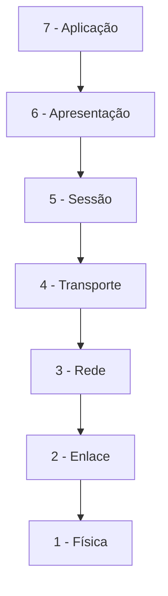
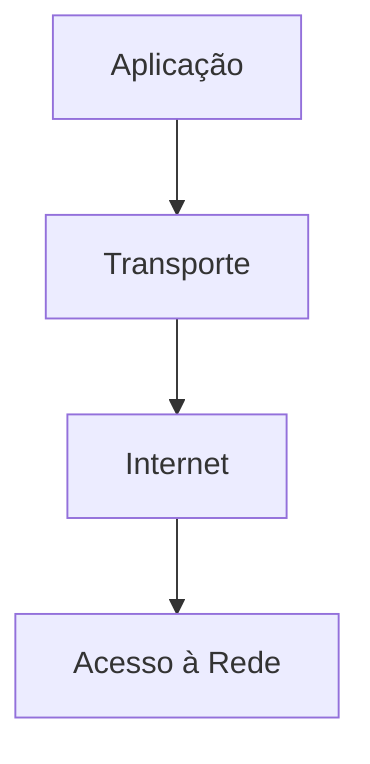
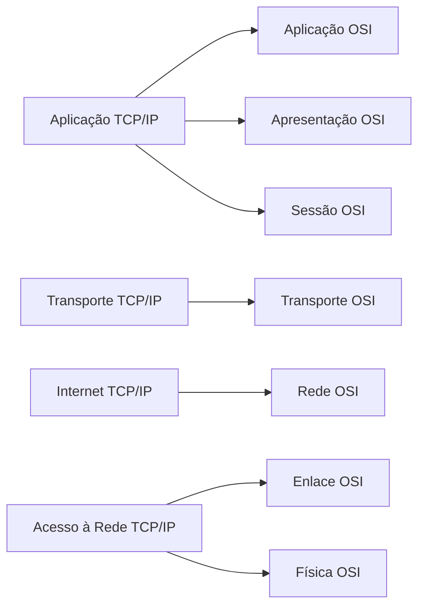
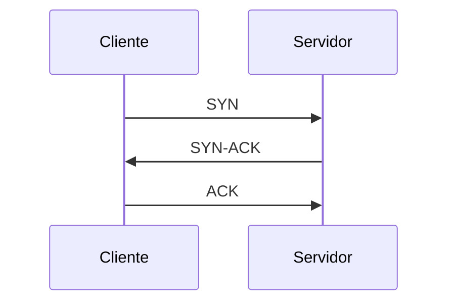
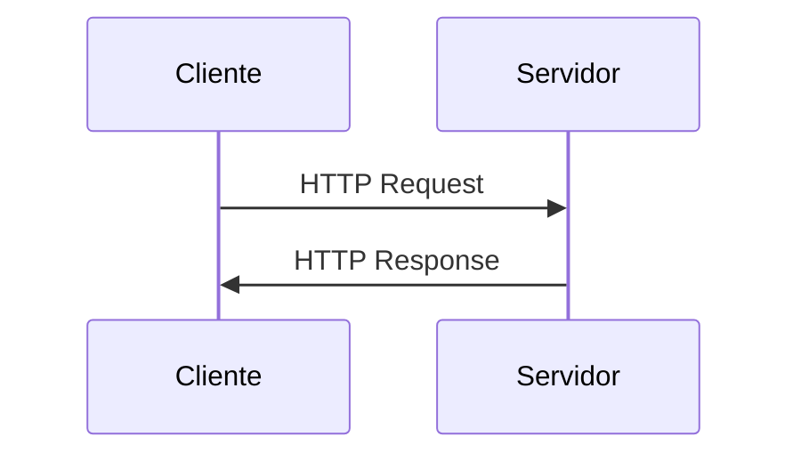
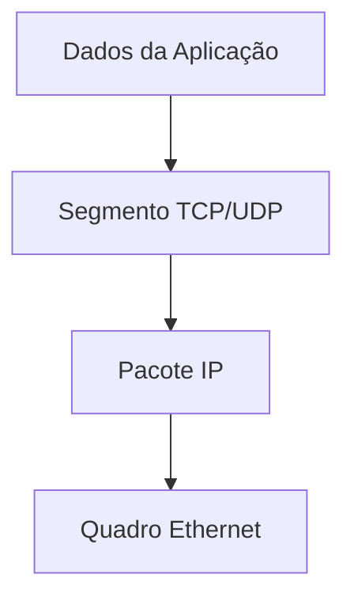

# Protocolos de Rede na Infraestrutura de Sistemas de Software

---

## Introdução

Sistemas de software modernos são, essencialmente, sistemas distribuídos. APIs, microsserviços, bancos de dados remotos, aplicações móveis e plataformas em nuvem comunicam-se continuamente por meio de protocolos de rede. Esses protocolos não são apenas convenções técnicas: eles são mecanismos estruturais que garantem interoperabilidade, confiabilidade, desempenho e segurança.

Compreender protocolos como TCP, UDP, HTTP, HTTPS, DNS e os modelos arquiteturais que os organizam — como OSI e TCP/IP — é fundamental para decisões de engenharia envolvendo escalabilidade, latência, tolerância a falhas e segurança.

Este material aprofunda o funcionamento dos principais protocolos utilizados atualmente, suas camadas de atuação e suas aplicações típicas na infraestrutura de software.

---

## 1. Organização da Comunicação: Modelo OSI e Modelo TCP/IP

### Contexto

A comunicação em redes é complexa porque envolve múltiplos dispositivos, meios físicos e regras de interoperabilidade. Para organizar essa complexidade, foram criados modelos conceituais em camadas.

---

## Modelo OSI (Open Systems Interconnection)

### Conceito

O modelo OSI organiza a comunicação em **7 camadas**, cada uma com responsabilidade bem definida.

### Camadas e Funções

1. **Física**  
Responsável pela transmissão de bits no meio físico (cabos, fibra, rádio).

2. **Enlace de Dados**  
Gerencia acesso ao meio físico e detecção de erros locais.

3. **Rede**  
Responsável pelo roteamento e endereçamento lógico (IP).

4. **Transporte**  
Entrega fim a fim, controle de erro e controle de fluxo.

5. **Sessão**  
Gerencia sessões de comunicação entre aplicações.

6. **Apresentação**  
Formatação, compressão e criptografia dos dados.

7. **Aplicação**  
Interface direta com aplicações do usuário.

### Aplicação Prática

O modelo OSI é amplamente utilizado como **modelo didático e de referência**, mas a Internet opera predominantemente sob o modelo TCP/IP.

---

## Modelo TCP/IP

### Conceito

Modelo prático utilizado na Internet, composto por **4 camadas**.

### Correspondência com OSI

---

## 2. Protocolo TCP (Transmission Control Protocol)

### Contexto

Aplicações críticas — como sistemas bancários, APIs REST e bancos de dados — exigem confiabilidade na entrega de dados.

### Conceito

TCP é um protocolo da camada de Transporte que fornece:

* Entrega confiável
* Controle de fluxo
* Controle de congestionamento
* Comunicação orientada à conexão

### Funcionamento

Antes da transmissão de dados, ocorre o **Three-Way Handshake**:

Após o estabelecimento da conexão:

* Os dados são segmentados
* Cada segmento recebe número de sequência
* O receptor confirma recebimento (ACK)
* Em caso de perda, ocorre retransmissão

### Controle de Vazão

O TCP utiliza janela deslizante.

A taxa efetiva pode ser aproximada por:

$$
Throughput \approx \frac{Window\ Size}{RTT}
$$

Onde:

* Window Size = tamanho da janela de envio
* RTT = Round Trip Time

### Aplicações Comuns

* HTTP / HTTPS
* SMTP (e-mail)
* FTP
* SSH
* Conexões com bancos de dados

### Quando Usar TCP

* Quando integridade dos dados é essencial
* Quando perda de pacotes é inaceitável

---

## 3. Protocolo UDP (User Datagram Protocol)

### Contexto

Algumas aplicações priorizam velocidade e baixa latência em vez de confiabilidade absoluta.

### Conceito

UDP é um protocolo de transporte:

* Não orientado à conexão
* Sem garantia de entrega
* Sem controle de congestionamento
* Baixa sobrecarga

### Funcionamento

O emissor envia datagramas diretamente, sem handshake prévio.

Não há:

* Confirmação de recebimento
* Reenvio automático
* Ordenação garantida

### Aplicações Comuns

* Streaming de vídeo
* Streaming de áudio
* VoIP
* Jogos online
* DNS

### Quando Usar UDP

* Quando pequenas perdas são toleráveis
* Quando latência é crítica

---

## 4. Protocolo IP (Internet Protocol)

### Contexto

Dispositivos precisam ser identificados logicamente para que dados sejam roteados.

### Conceito

IP é o protocolo da camada Internet responsável por:

* Endereçamento lógico
* Roteamento entre redes

Existem duas versões principais:

* IPv4
* IPv6

### Funcionamento

Cada pacote contém:

* Endereço IP de origem
* Endereço IP de destino
* TTL (Time To Live)

O roteador analisa o endereço de destino e decide o próximo salto.

### Aplicações

IP é a base de toda comunicação na Internet.

---

## 5. HTTP e HTTPS

### Contexto

Aplicações web dependem da troca estruturada de mensagens entre cliente e servidor.

### Conceito

HTTP (Hypertext Transfer Protocol) é um protocolo da camada de Aplicação que opera sobre TCP.

HTTPS é HTTP sobre TLS (criptografia).

### Funcionamento

Modelo requisição-resposta:

### Aplicações Comuns

* APIs REST
* Aplicações web
* Serviços SaaS
* Comunicação entre microsserviços

---

## 6. DNS (Domain Name System)

### Contexto

Usuários não memorizam endereços IP.

### Conceito

DNS traduz nomes de domínio em endereços IP.

### Funcionamento

1. Cliente consulta servidor DNS
2. DNS responde com IP correspondente
3. Comunicação continua via IP

### Aplicação

* Navegação web
* Resolução de serviços internos
* Balanceamento de carga

---

## 7. TLS (Transport Layer Security)

### Contexto

Comunicação em redes públicas exige segurança.

### Conceito

TLS fornece:

* Criptografia
* Autenticação
* Integridade

### Funcionamento Simplificado

1. Handshake criptográfico
2. Troca de chaves
3. Comunicação cifrada

### Aplicações

* HTTPS
* APIs seguras
* Transações financeiras
* Comunicação entre microsserviços

---

## 8. Encapsulamento na Prática

A comunicação percorre camadas adicionando cabeçalhos.

Cada camada adiciona:

* Informações de controle
* Endereçamento
* Metadados de integridade

---

## Conclusão

Protocolos de rede são a base operacional da infraestrutura de software. TCP garante confiabilidade. UDP prioriza desempenho. IP viabiliza roteamento global. HTTP estrutura aplicações web. DNS torna a rede utilizável por humanos. TLS garante segurança.

Engenheiros de software que compreendem esses protocolos conseguem:

* Projetar sistemas mais eficientes
* Diagnosticar gargalos
* Escolher corretamente tecnologias
* Otimizar desempenho e segurança

---

## Análise Crítica

Nem sempre o protocolo mais confiável é o mais adequado. Em arquiteturas modernas, decisões entre TCP e UDP, uso de HTTP/2 ou HTTP/3 (QUIC sobre UDP), ou configuração de TLS impactam diretamente:

* Latência
* Escalabilidade
* Consumo de recursos
* Experiência do usuário

Escolhas inadequadas podem comprometer desempenho global.

---

## Exercício Resolvido

### Comparação de Throughput TCP

Uma aplicação possui:

* Window Size = 64 KB
* RTT = 40 ms

Calcule o throughput máximo teórico.

1 KB = 1024 bytes
64 KB = $64 \times 1024 = 65536$ bytes

Convertendo para bits:

$$
65536 \times 8 = 524288 \text{ bits}
$$

RTT = 40 ms = 0,04 s

Aplicando:

$$
Throughput = \frac{524288}{0,04}
$$

$$
Throughput = 13.107.200 \text{ bits/s}
$$

$$
Throughput \approx 13,1 \text{ Mbps}
$$

---

## Bibliografia (ABNT)

KUROSE, James F.; ROSS, Keith W. Redes de Computadores e a Internet. 6. ed. São Paulo: Pearson, 2013.

TANENBAUM, Andrew S.; WETHERALL, David J. Redes de Computadores. 5. ed. São Paulo: Pearson, 2011.

STALLINGS, William. Data and Computer Communications. 10. ed. Pearson, 2013.

---

## Materiais Complementares (ABNT)

IETF. Internet Engineering Task Force. Disponível em: [https://www.ietf.org](https://www.ietf.org)

RFC Editor. The Request for Comments Series. Disponível em: [https://www.rfc-editor.org](https://www.rfc-editor.org)

---
