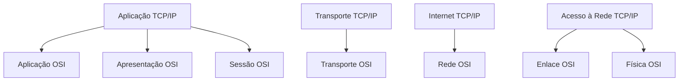

# Redes de Computadores na Infraestrutura de Sistemas de Software

---

## Introdução

A infraestrutura de sistemas de software modernos é, essencialmente, uma infraestrutura de comunicação. Aplicações distribuídas, arquiteturas em microserviços, computação em nuvem, plataformas SaaS e dispositivos inteligentes dependem de redes de computadores para existir. Não há software corporativo relevante hoje que não opere sobre uma rede — seja ela local, metropolitana ou global.

Compreender redes de computadores não é apenas uma habilidade complementar para o engenheiro de software; é uma competência estrutural. Ao projetar um sistema distribuído, ao dimensionar uma aplicação para nuvem ou ao diagnosticar problemas de desempenho, estamos lidando diretamente com conceitos de comunicação, latência, vazão, protocolos e organização em camadas.

Este capítulo apresenta os fundamentos de redes de computadores sob a perspectiva da infraestrutura para sistemas de software, estabelecendo as bases conceituais necessárias para o estudo de arquiteturas distribuídas, serviços em nuvem e aplicações conectadas.

---

## 1. Fundamentos e Objetivos das Redes de Computadores

### Contexto

Sistemas modernos raramente operam isoladamente. Um backend comunica-se com bancos de dados remotos, APIs externas, serviços de autenticação, filas de mensagens e dispositivos clientes distribuídos globalmente. Esse ecossistema só é possível porque existe uma estrutura que permite comunicação entre elementos computacionais distintos.

### Conceito

Uma rede de computadores é um conjunto de dispositivos interconectados capazes de trocar informações entre si por meio de regras e tecnologias padronizadas.

Esses dispositivos podem incluir:

* Computadores pessoais
* Servidores
* Roteadores
* Switches
* Smartphones
* Dispositivos IoT

O propósito fundamental de uma rede é permitir:

* Comunicação entre dispositivos
* Compartilhamento de recursos
* Execução remota de aplicações
* Distribuição de dados multimídia

### Funcionamento

A comunicação ocorre por meio de enlaces físicos ou sem fio que conectam dispositivos. Esses enlaces transportam sinais elétricos, ópticos ou eletromagnéticos que representam dados digitais.

A rede transforma bits (0 e 1) em sinais físicos e os reconverte no destino.

### Exemplo Explicado

Considere uma aplicação web hospedada em um servidor na nuvem. Quando um usuário acessa essa aplicação:

1. Seu dispositivo gera uma requisição.
2. Essa requisição percorre diversos roteadores.
3. A mensagem chega ao servidor.
4. O servidor responde.
5. A resposta percorre o caminho inverso.

Todo esse processo é mediado pela infraestrutura de rede.

---

## 2. Elementos que Compõem uma Rede

### Contexto

Para que a comunicação aconteça, diferentes tipos de componentes desempenham papéis específicos.

### Conceito

Os principais elementos de uma rede incluem:

* Dispositivos finais (hosts)
* Dispositivos intermediários
* Meio físico
* Protocolos

### Funcionamento

Os dispositivos finais geram e consomem dados.
Os dispositivos intermediários direcionam e organizam o tráfego.
O meio físico transporta os sinais.
Os protocolos definem as regras da comunicação.

### Diagrama Estrutural Simplificado

Esse fluxo representa uma comunicação típica cliente-servidor.

---

## 3. Links de Comunicação e Vazão

### Contexto

Nem todos os enlaces de rede oferecem o mesmo desempenho. A capacidade de transporte de dados impacta diretamente sistemas distribuídos.

### Conceito

A vazão (throughput) é a taxa efetiva de transferência de dados em um link de comunicação.

Ela pode ser representada por:

$$
T = \frac{D}{t}
$$

Onde:

* $T$ = vazão (bits por segundo)
* $D$ = quantidade de dados transmitidos (bits)
* $t$ = tempo gasto (segundos)

### Funcionamento

A vazão depende de:

* Tecnologia do meio físico (fibra, cobre, rádio)
* Congestionamento
* Capacidade dos dispositivos intermediários

### Exemplo Resolvido

Suponha que 500 MB sejam transmitidos em 20 segundos.

Primeiro convertemos para bits:

1 byte = 8 bits  
500 MB = $500 \times 10^6$ bytes

$$
D = 500 \times 10^6 \times 8
$$

$$
D = 4 \times 10^9 \text{ bits}
$$

Aplicando na fórmula:

$$
T = \frac{4 \times 10^9}{20}
$$

$$
T = 2 \times 10^8 \text{ bits/s}
$$

Portanto:

$$
T = 200 \text{ Mbps}
$$

---

## 4. Protocolos de Rede

### Contexto

Se dispositivos simplesmente enviassem sinais sem regras, a comunicação seria impossível.

### Conceito

Protocolos são conjuntos de regras que definem como dados são:

* Formatados
* Transmitidos
* Recebidos
* Interpretados

### Funcionamento

Um protocolo define:

* Estrutura da mensagem
* Sequência de envio
* Tratamento de erros
* Controle de fluxo

Sem protocolos, não há interoperabilidade.

---

## 5. Comunicação em Camadas

### Contexto

A comunicação em rede é complexa. Para gerenciar essa complexidade, ela é organizada em camadas.

### Conceito

O modelo em camadas divide a comunicação em níveis hierárquicos, cada um com responsabilidade específica.

### Razão da Organização

* Separação de responsabilidades
* Independência de implementação
* Facilitação da manutenção
* Padronização global

---

## 6. Modelos de Referência: OSI e TCP/IP

### Modelo OSI

Possui 7 camadas:

1. Física
2. Enlace
3. Rede
4. Transporte
5. Sessão
6. Apresentação
7. Aplicação

### Modelo TCP/IP

Mais utilizado na prática, possui 4 camadas:

1. Aplicação
2. Transporte
3. Internet
4. Acesso à Rede

### Comparação

---

## 7. Encapsulamento

### Conceito

Encapsulamento é o processo pelo qual cada camada adiciona seu próprio cabeçalho à mensagem.

### Funcionamento

Aplicação → Transporte → Internet → Acesso à Rede

Cada camada adiciona informações de controle.

### Representação

---

## 8. Internet e World Wide Web

### Internet

É uma rede de redes interconectadas globalmente.

### WWW

É uma aplicação distribuída que utiliza a infraestrutura da Internet.

A Internet é a infraestrutura.
A WWW é um serviço executado sobre essa infraestrutura.

---

## Conclusão

Redes de computadores constituem a base da infraestrutura de sistemas modernos. Elas permitem comunicação, compartilhamento de recursos e execução distribuída de aplicações. A organização em camadas viabiliza a interoperabilidade global e simplifica o desenvolvimento de sistemas complexos.

Compreender redes é compreender como sistemas distribuídos realmente funcionam.

---

## Análise Crítica

A abstração em camadas simplifica o entendimento, mas pode ocultar gargalos reais. Engenheiros de software precisam compreender o que ocorre em níveis inferiores para diagnosticar problemas de latência, perda de pacotes e congestionamento.

Ignorar fundamentos de rede pode levar a decisões arquiteturais inadequadas.

---

## Exercícios Resolvidos

### 1. Cálculo de Vazão

Um arquivo de 1 GB é transferido em 40 segundos. Qual a vazão?

1 GB = $1 \times 10^9$ bytes

$$
D = 1 \times 10^9 \times 8
$$

$$
D = 8 \times 10^9 \text{ bits}
$$

$$
T = \frac{8 \times 10^9}{40}
$$

$$
T = 2 \times 10^8
$$

$$
T = 200 \text{ Mbps}
$$

---

## Bibliografia

KUROSE, James F.; ROSS, Keith W. *Redes de Computadores e a Internet*. 6. ed. São Paulo: Pearson, 2013.

TANENBAUM, Andrew S.; WETHERALL, David J. *Redes de Computadores*. 5. ed. São Paulo: Pearson, 2011.

---

## Materiais Complementares

IETF – Internet Engineering Task Force. Disponível em: [https://www.ietf.org](https://www.ietf.org)

RFC Editor. Disponível em: [https://www.rfc-editor.org](https://www.rfc-editor.org)

---

Se desejar, posso expandir este material para um nível ainda mais aprofundado, incluindo:

* Cálculo de latência fim a fim
* Controle de congestionamento TCP
* NAT e IPv6
* Subnetting com resolução detalhada
* QoS em infraestrutura de software

Basta indicar o nível desejado.
