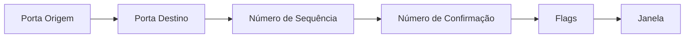
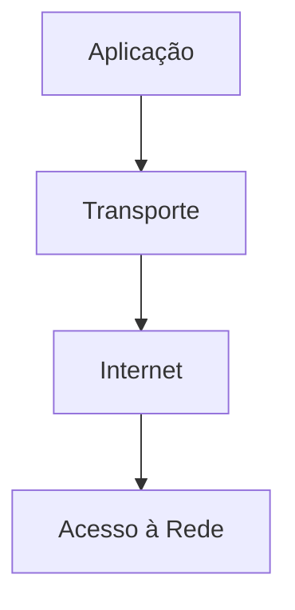
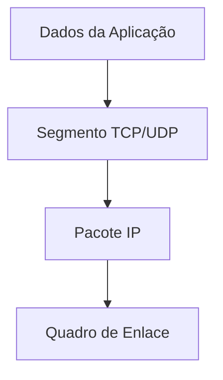
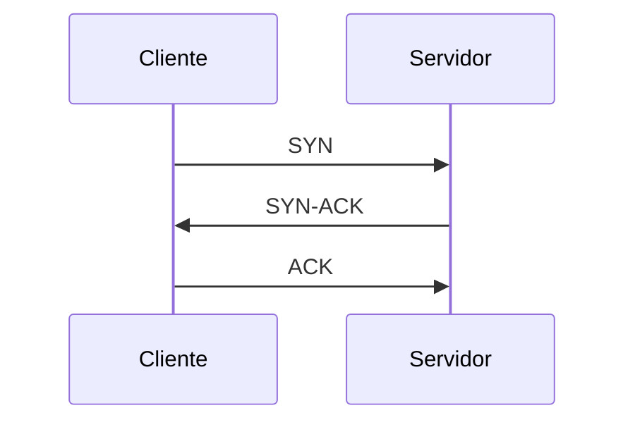

# Protocolos de Comunicação na Infraestrutura de Sistemas de Software

---

## Introdução

A comunicação entre sistemas computacionais não ocorre de forma espontânea ou improvisada. Quando dois sistemas trocam informações, essa troca é regida por um conjunto de regras previamente definidas, conhecidas como **protocolos de comunicação**. Esses protocolos constituem a base operacional da Internet e de qualquer infraestrutura distribuída.

Em ambientes modernos de software — especialmente em arquiteturas orientadas a serviços, microsserviços e computação em nuvem — os protocolos de comunicação determinam como dados são estruturados, transmitidos, roteados, recebidos e interpretados. Compreender esses protocolos não é apenas uma questão teórica; trata-se de uma competência essencial para projetar sistemas robustos, escaláveis e interoperáveis.

Este material apresenta os fundamentos dos protocolos de comunicação, seus elementos estruturais, o papel da padronização, o modelo TCP/IP e o funcionamento detalhado dos protocolos IP, TCP e UDP, incluindo o conceito de portas e o processo de encapsulamento.

---

## O que é um Protocolo de Comunicação?

### Contexto

Imagine dois sistemas desenvolvidos por fabricantes diferentes, executando sistemas operacionais distintos e implementados em linguagens diversas. Para que consigam se comunicar, é necessário que compartilhem um entendimento comum sobre:

* Como iniciar a comunicação;
* Como estruturar mensagens;
* Como interpretar informações;
* Como lidar com erros.

Sem um conjunto padronizado de regras, a comunicação seria impossível.

### Conceito

Um **protocolo de comunicação** é um conjunto formal de regras que define como entidades computacionais trocam informações em uma rede.

Essas regras especificam:

* A estrutura das mensagens;
* A ordem dos eventos;
* Os mecanismos de controle;
* O tratamento de erros.

### Analogia com Comunicação Humana

Na comunicação humana, para que uma conversa seja bem-sucedida, é necessário:

* Um idioma comum;
* Regras gramaticais;
* Turnos de fala;
* Contexto compartilhado.

Se uma pessoa fala português e outra apenas japonês, a comunicação falha. De modo análogo, se dois sistemas não seguem o mesmo protocolo, a troca de dados torna-se inviável.

Essa analogia ilustra que protocolos não são apenas formatos técnicos; são estruturas organizadas que permitem entendimento mútuo.

---

## Elementos Estruturais de um Protocolo

### Contexto

Protocolos não são apenas formatos de mensagens. Eles são sistemas completos que especificam comportamento, ambiente e mecanismos de controle.

### Conceito

Um protocolo pode ser analisado a partir de cinco elementos fundamentais:

1. **Serviços oferecidos**
2. **Ambiente de execução**
3. **Vocabulário**
4. **Formato de mensagem**
5. **Algoritmos de controle**

### Funcionamento Detalhado

#### 1. Serviços Oferecidos

Definem o que o protocolo entrega às camadas superiores.
Exemplo: o TCP oferece entrega confiável e ordenada.

#### 2. Ambiente de Execução

Define em qual camada o protocolo opera e com quais outros protocolos interage.

#### 3. Vocabulário

Conjunto de comandos e mensagens possíveis.  
Exemplo no **HTTP**: `GET`, `POST`, `PUT`, `DELETE`.

#### 4. Formato de Mensagem

Define a estrutura binária ou textual da mensagem.

Exemplo simplificado de cabeçalho TCP:

Cada campo possui tamanho específico e significado definido.

#### 5. Algoritmos

Determinam o comportamento dinâmico do protocolo, como:

* Controle de congestionamento
* Retransmissão
* Estabelecimento de conexão

---

## RFCs e Padronização

### Contexto

A interoperabilidade global exige documentação formal e pública.

### Conceito

Os **RFCs (Requests for Comments)** são documentos técnicos que especificam padrões da Internet.

Eles definem:

* Sintaxe das mensagens;
* Semântica dos campos;
* Regras de operação.

Essa padronização garante que implementações independentes possam interoperar.

### Semântica e Sintaxe

* **Sintaxe**: formato estrutural da mensagem.
* **Semântica**: significado das informações.

Um protocolo bem definido especifica ambos.

---

## Modelo TCP/IP como Base da Internet

### Contexto

A Internet opera sobre uma arquitetura em camadas que organiza responsabilidades.

### Conceito

O modelo TCP/IP possui quatro camadas:

Cada camada executa funções específicas e fornece serviços à camada superior.

---

## Encapsulamento e Desencapsulamento

### Contexto

Quando uma aplicação envia dados, esses dados percorrem as camadas do modelo.

### Conceito

**Encapsulamento** é o processo pelo qual cada camada adiciona seu próprio cabeçalho aos dados recebidos da camada superior.

### Processo

1. A aplicação gera dados.
2. O TCP/UDP adiciona cabeçalho de transporte.
3. O IP adiciona cabeçalho de rede.
4. A camada de enlace encapsula em um quadro físico.

No destino, ocorre o processo inverso: **desencapsulamento**.

---

## Protocolo IP

### Contexto

Em uma rede global, dispositivos precisam ser identificados logicamente.

### Conceito

O **Internet Protocol (IP)** é responsável por:

* Endereçamento lógico;
* Determinação de caminhos;
* Encaminhamento de pacotes.

### Funcionamento

Cada pacote IP contém:

* Endereço IP de origem;
* Endereço IP de destino;
* TTL (Time To Live).

O roteamento ocorre salto a salto, com base em tabelas de roteamento.

### Modelo de Melhor Esforço

O IP opera sob o princípio de **best effort**:

* Não garante entrega;
* Não garante ordem;
* Não garante integridade.

Ele apenas tenta encaminhar o pacote.

---

## Protocolo TCP

### Contexto

Aplicações críticas exigem confiabilidade.

### Conceito

O **Transmission Control Protocol (TCP)** fornece:

* Comunicação orientada à conexão;
* Entrega confiável;
* Controle de fluxo;
* Controle de congestionamento.

### Estabelecimento de Conexão

### Controle de Fluxo

O TCP utiliza janela deslizante.

O throughput teórico pode ser estimado por:

$$
Throughput \approx \frac{Janela}{RTT}
$$

Onde:

* Janela = tamanho da janela de envio (bits)
* RTT = tempo de ida e volta

### Exemplo Resolvido

Janela = 32 KB
RTT = 50 ms

32 KB = $32 \times 1024 = 32768$ bytes

Convertendo para bits:

$$
32768 \times 8 = 262144 \text{ bits}
$$

RTT = 0,05 s

$$
Throughput = \frac{262144}{0,05}
$$

$$
Throughput = 5.242.880 \text{ bits/s}
$$

$$
\approx 5,24 \text{ Mbps}
$$

---

## Protocolo UDP

### Contexto

Algumas aplicações priorizam baixa latência.

### Conceito

O **User Datagram Protocol (UDP)**:

* Não estabelece conexão;
* Não confirma recebimento;
* Não realiza retransmissão;
* Possui cabeçalho simplificado.

### Aplicações Típicas

* Streaming
* Jogos online
* DNS
* VoIP

---

## Portas de Comunicação

### Contexto

Um único dispositivo pode executar várias aplicações simultaneamente.

### Conceito

Portas são números que identificam aplicações específicas dentro de um host.

Intervalo possível:

$$
0 \leq Porta \leq 65535
$$

Total de portas possíveis:

$$
2^{16} = 65536
$$

### Exemplos

* 80 → HTTP
* 443 → HTTPS
* 53 → DNS

### Tamanho de Cabeçalhos

* TCP: mínimo de 20 bytes
* UDP: 8 bytes

---

## Conclusão

Protocolos de comunicação são a base estrutural da Internet e da infraestrutura de software moderna. O IP fornece endereçamento e roteamento sob modelo de melhor esforço. O TCP adiciona confiabilidade e controle. O UDP oferece simplicidade e baixa latência. Portas identificam aplicações. RFCs garantem padronização.

Sem essa organização em camadas e protocolos bem definidos, sistemas distribuídos seriam inviáveis.

---

## Análise Crítica

Embora a abstração em camadas simplifique o desenvolvimento, ela pode ocultar limitações práticas como:

* Congestionamento;
* Latência elevada;
* Perda de pacotes.

Engenheiros de software devem compreender as implicações reais de escolher TCP ou UDP, bem como os impactos do controle de congestionamento na escalabilidade.

---

## Sugestões de Complementação

* HTTP/2 e HTTP/3 (QUIC)
* Controle de congestionamento TCP (Reno, Cubic)
* IPv6 e NAT
* Protocolos de mensageria (MQTT, AMQP)

---

## Exercícios Resolvidos

### 1. Quantidade de Portas

Quantas portas distintas existem?

$$
2^{16} = 65536
$$

---

### 2. Cálculo de Throughput TCP

Janela = 128 KB
RTT = 100 ms

128 KB = $128 \times 1024 = 131072$ bytes

Convertendo:

$$
131072 \times 8 = 1.048.576 \text{ bits}
$$

RTT = 0,1 s

$$
Throughput = \frac{1.048.576}{0,1}
$$

$$
= 10.485.760 \text{ bits/s}
$$

$$
\approx 10,48 \text{ Mbps}
$$

---

## Bibliografia (ABNT)

KUROSE, James F.; ROSS, Keith W. Redes de Computadores e a Internet. 6. ed. São Paulo: Pearson, 2013.

TANENBAUM, Andrew S.; WETHERALL, David J. Redes de Computadores. 5. ed. São Paulo: Pearson, 2011.

STALLINGS, William. Data and Computer Communications. 10. ed. Pearson, 2013.

---

## Materiais Complementares (ABNT)

IETF. Internet Engineering Task Force. Disponível em: [https://www.ietf.org](https://www.ietf.org)

RFC Editor. The Request for Comments Series. Disponível em: [https://www.rfc-editor.org](https://www.rfc-editor.org)

---
