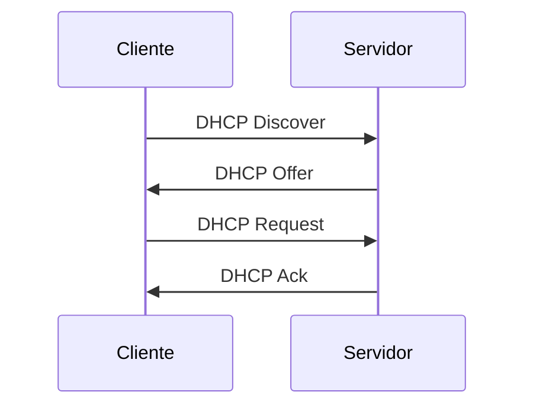

# Endereçamento IP (IPv4) na Infraestrutura de Sistemas de Software

---

## Introdução

A comunicação em redes depende de um elemento fundamental: **endereçamento lógico**. Para que um datagrama atravesse múltiplas redes e chegue ao destino correto, é necessário que cada dispositivo possua um identificador único dentro de um determinado contexto. Esse identificador é o **endereço IP**.

No contexto da infraestrutura de sistemas de software, compreender endereçamento IP é essencial para:

* Configuração de servidores e ambientes em nuvem;
* Segmentação de redes corporativas;
* Implementação de políticas de segurança;
* Provisionamento automático de infraestrutura;
* Diagnóstico de problemas de conectividade.

Este capítulo aprofunda o estudo do **IPv4**, sua estrutura, seus campos relevantes, os mecanismos de subnetting, o CIDR, operações binárias aplicadas ao endereçamento e o papel do DHCP, consolidando o conhecimento necessário para atuação profissional em infraestrutura.

---

## Estrutura do Endereço IPv4

### Contexto

Para permitir bilhões de dispositivos interconectados, o protocolo IP define um espaço de endereçamento estruturado. No IPv4, esse espaço é limitado e exige uso eficiente.

### Conceito

O **IPv4 (Internet Protocol version 4)** utiliza endereços de **32 bits**.

Formalmente:

$$
Endereço\ IPv4 = 32\ bits
$$

Esses 32 bits são divididos em 4 octetos de 8 bits cada:

$$
8\ bits + 8\ bits + 8\ bits + 8\ bits = 32\ bits
$$

Cada octeto varia de 0 a 255:

$$
0 \leq octeto \leq 255
$$

Exemplo:

```
192.168.1.10
```

### Espaço Total de Endereços

O número total de combinações possíveis é:

$$
2^{32}
$$

Calculando:

$$
2^{32} = 4.294.967.296
$$

Portanto, existem aproximadamente 4,29 bilhões de endereços IPv4 possíveis.

---

## Estrutura do Cabeçalho IPv4

### Contexto

Além do endereço, o IPv4 define um cabeçalho que orienta o roteamento e o controle do datagrama.

### Estrutura Simplificada


### Campos Relevantes

#### Tipo de Serviço (ToS)

Permite indicar prioridade de encaminhamento. Hoje evoluiu para o campo **DSCP**, utilizado em QoS.

#### Fragmentação (MTU)

Cada meio físico possui uma **MTU (Maximum Transmission Unit)**.
Se o datagrama exceder essa capacidade, ele será fragmentado.

#### Time To Live (TTL)

Campo de 8 bits que limita o número de saltos que o pacote pode percorrer.

Se:

$$
TTL = 64
$$

O pacote poderá atravessar no máximo 64 roteadores antes de ser descartado.

#### Protocolo

Identifica qual protocolo de transporte está encapsulado:

* 6 → TCP
* 17 → UDP

#### Checksum

Verifica integridade do cabeçalho.

#### Endereço de Origem e Destino

Identificam remetente e destinatário.

---

## Classes de Endereçamento IPv4

### Contexto

Inicialmente, o IPv4 foi dividido em classes fixas.

### Classes

| Classe | Primeiro Octeto | Máscara Padrão | Nº de Redes | Nº de Hosts |
| ------ | --------------- | -------------- | ----------- | ----------- |
| A      | 0–127           | 255.0.0.0      | Poucas      | Muitos      |
| B      | 128–191         | 255.255.0.0    | Médio       | Médio       |
| C      | 192–223         | 255.255.255.0  | Muitas      | Poucos      |
| D      | 224–239         | Multicast      | —           | —           |
| E      | 240–255         | Reservado      | —           | —           |

### Ineficiência

O modelo fixo desperdiçava endereços.
Uma empresa que precisasse de 500 hosts, por exemplo, teria que usar Classe B (65.534 hosts possíveis), desperdiçando milhares de endereços.

---

## CIDR — Classless Inter-Domain Routing

### Contexto

Para resolver a ineficiência das classes fixas, foi criado o CIDR.

### Conceito

O CIDR permite dividir o endereço em rede e host com qualquer número de bits.

Notação:

```
192.168.1.0/24
```

O número após a barra indica quantos bits representam a rede.

### Formalização

Se:

$$
Prefixo = /n
$$

Então:

* n bits → rede
* (32 − n) bits → hosts

---

## Máscara de Rede

### Conceito

A máscara determina quais bits pertencem à rede.

Exemplo:

```
/24 → 255.255.255.0
```

Representação binária:

```
11111111.11111111.11111111.00000000
```

---

## Operações AND e OR

### Endereço de Rede (Operação AND)

Para encontrar o endereço de rede:

$$
IP\ AND\ Máscara
$$

Exemplo:

IP: 192.168.1.10
Máscara: 255.255.255.0

Resultado:

192.168.1.0

### Endereço de Broadcast (Operação OR)

Para encontrar o broadcast:

$$
Rede\ OR\ NOT(Máscara)
$$

---

## Criação de Sub-redes

### Contexto

Subnetting permite dividir uma rede maior em redes menores.

### Fórmulas Fundamentais

Número de hosts válidos:

$$
2^{h} - 2
$$

Onde:

* h = número de bits para host
* −2 remove rede e broadcast

---

## Exemplo Completo de Cálculo

Rede:

```
192.168.10.0/26
```

Prefixo = 26 bits

Bits de host:

$$
32 - 26 = 6
$$

Número total de endereços:

$$
2^6 = 64
$$

Hosts válidos:

$$
64 - 2 = 62
$$

Portanto, essa sub-rede suporta 62 hosts válidos.

---

## Protocolo DHCP

### Contexto

Configurar IP manualmente em grandes redes é inviável.

### Conceito

O **DHCP (Dynamic Host Configuration Protocol)** atribui automaticamente:

* Endereço IP
* Máscara
* Gateway
* DNS

### Funcionamento



---

## Redes Privadas

### Faixas Reservadas

* 10.0.0.0/8
* 172.16.0.0/12
* 192.168.0.0/16

Esses endereços não são roteáveis na Internet pública.

---

## Importância para Administradores e Desenvolvedores

### Administração de Redes

* Planejamento de sub-redes
* Segmentação de segurança
* Balanceamento de carga
* Controle de broadcast

### Desenvolvimento de Sistemas

* Configuração de ambientes em nuvem
* Deploy de aplicações distribuídas
* Configuração de containers e orquestradores
* Diagnóstico de problemas de conectividade

Sem domínio de endereçamento IP, decisões arquiteturais tornam-se frágeis.

---

## Conclusão

O IPv4 estrutura o endereçamento lógico da Internet por meio de 32 bits organizados em rede e host. A evolução das classes fixas para o CIDR permitiu uso eficiente do espaço de endereçamento. Operações binárias como AND e OR são essenciais para cálculo de redes e broadcast. O DHCP automatiza a atribuição de endereços, enquanto redes privadas permitem segmentação segura.

Compreender esses conceitos é fundamental para atuação sólida em infraestrutura de software.

---

## Análise Crítica

O IPv4 enfrenta esgotamento de endereços, o que impulsionou o IPv6. Além disso, má configuração de sub-redes pode gerar:

* Excesso de broadcast
* Vulnerabilidades
* Ineficiência de roteamento

Planejamento adequado é essencial.

---

## Sugestões de Complementação

* IPv6 e estrutura de 128 bits
* NAT e PAT
* VLSM avançado
* Planejamento de endereçamento em ambientes cloud

---

## Exercícios (com resolução)

### 1. Quantos hosts existem em uma rede /27?

Bits de host:

$$
32 - 27 = 5
$$

Total:

$$
2^5 = 32
$$

Hosts válidos:

$$
32 - 2 = 30
$$

---

### 2. Determine o endereço de rede de 192.168.50.34/28

/28 → 4 bits de host

$$
2^4 = 16\ endereços
$$

Blocos de 16:

* 0–15
* 16–31
* 32–47

34 está no bloco 32–47

Endereço de rede:

```
192.168.50.32
```

Broadcast:

```
192.168.50.47
```

Hosts válidos:

33 a 46

---

## Bibliografia (ABNT)

KUROSE, James F.; ROSS, Keith W. Redes de Computadores e a Internet. 6. ed. São Paulo: Pearson, 2013.

TANENBAUM, Andrew S.; WETHERALL, David J. Redes de Computadores. 5. ed. São Paulo: Pearson, 2011.

STALLINGS, William. Data and Computer Communications. 10. ed. Pearson, 2013.

---

## Materiais Complementares (ABNT)

IETF. RFC 791 – Internet Protocol.

IETF. RFC 2131 – Dynamic Host Configuration Protocol.

---

Se desejar, posso agora aprofundar para nível profissional com:

* VLSM completo com múltiplas sub-redes
* Planejamento de IP para empresa
* CIDR e agregação de rotas
* IPv6 comparativo detalhado
