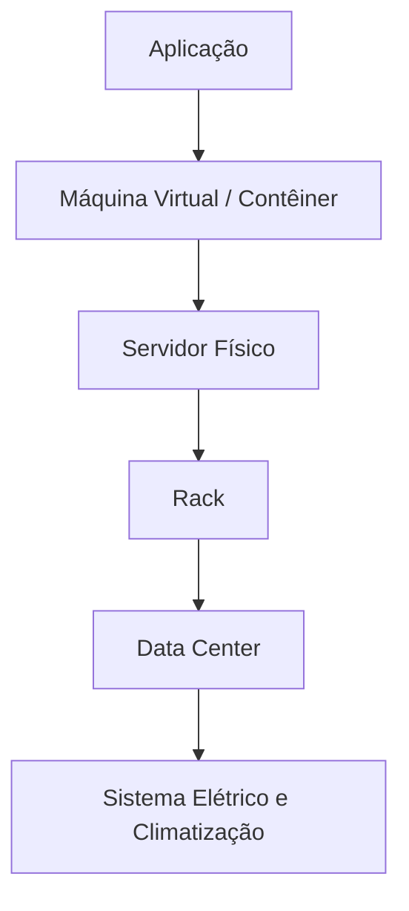
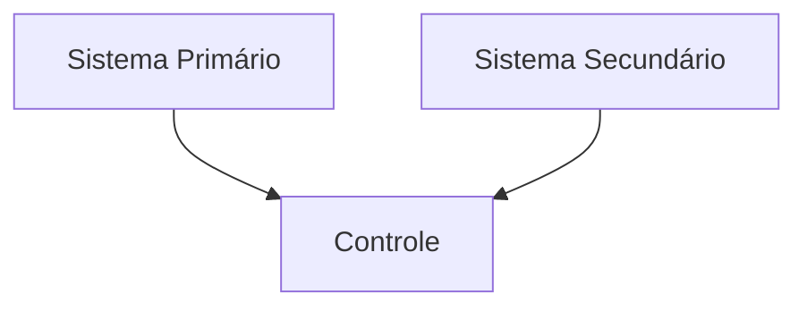
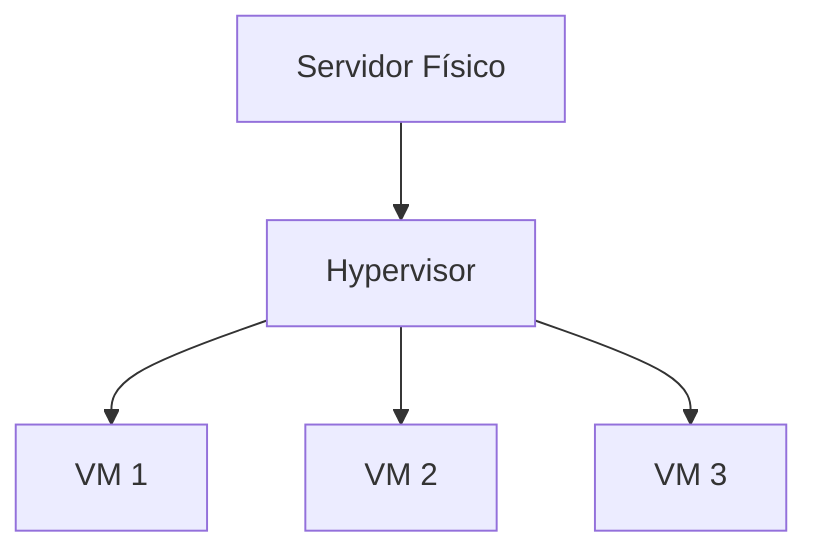

# Infraestrutura Computacional: Fundamentos, Componentes e Projetos Abertos

---

## Introdução

A infraestrutura computacional constitui a base material e lógica sobre a qual sistemas de software são executados. Toda aplicação — desde um simples serviço web até plataformas globais de computação em nuvem — depende de um conjunto estruturado de recursos físicos, energéticos, ambientais e lógicos para operar de maneira confiável.

Para o engenheiro de software, compreender infraestrutura não é apenas uma questão de conhecer servidores ou redes. Trata-se de entender como processamento, armazenamento, energia, conectividade, virtualização, segurança e resiliência se integram para sustentar aplicações modernas. A percepção do usuário final sobre desempenho, disponibilidade e segurança é diretamente impactada por decisões tomadas na camada de infraestrutura.

Este capítulo explora a importância da infraestrutura computacional, seus componentes em diferentes níveis de granularidade, exemplos de aplicação em ambientes críticos e acadêmicos, e iniciativas contemporâneas como o Open Compute Project, que propõem uma abordagem aberta e padronizada para construção de data centers.

---

## A Infraestrutura como Base da Execução de Sistemas

### Contexto

Quando um usuário percebe lentidão em uma aplicação ou enfrenta indisponibilidade de serviço, a causa raramente é evidente. O problema pode estar na aplicação, na rede, no armazenamento, na virtualização ou até mesmo em fatores ambientais como temperatura inadequada ou falha energética.

Em ambientes privados e em nuvens públicas, a infraestrutura funciona como um ecossistema interdependente. Qualquer desequilíbrio pode comprometer a experiência do usuário.

### Conceito

Infraestrutura computacional é o conjunto integrado de:

* Recursos de processamento;
* Sistemas de armazenamento;
* Componentes de rede;
* Sistemas de energia;
* Sistemas ambientais;
* Camadas de virtualização e orquestração.

Ela pode ser disponibilizada como **Infraestrutura como Serviço (IaaS)**, modelo no qual o usuário consome recursos computacionais sob demanda sem visualizar sua complexidade interna.

### Funcionamento Sistêmico

A execução de uma aplicação depende de múltiplos subsistemas:

Cada nível depende do anterior. Se o sistema elétrico falha, o servidor é desligado; se o servidor falha, a aplicação se torna indisponível.

---

## Classificação dos Componentes da Infraestrutura

A análise da infraestrutura pode ser feita sob duas perspectivas: granularidade grossa (macrocomponentes) e granularidade fina (microcomponentes).

---

## Macrocomponentes (Granularidade Grossa)

### Contexto

No planejamento de data centers ou ambientes corporativos, os macrocomponentes representam as grandes unidades funcionais.

### Conceito

Incluem:

* Servidores (processamento);
* Sistemas de armazenamento;
* Switches e roteadores;
* No-breaks (UPS);
* Geradores;
* Sistemas de ventilação e controle térmico;
* Sistemas de segurança física.

### Energia e Continuidade

A disponibilidade de sistemas computacionais depende diretamente da continuidade do fornecimento de energia elétrica. Em ambientes de infraestrutura crítica — como data centers, hospitais, instituições financeiras e centros de pesquisa — a interrupção de energia, mesmo por milissegundos, pode causar corrupção de dados, reinicialização abrupta de servidores, falhas em transações e indisponibilidade de serviços.

Por essa razão, a arquitetura elétrica de uma infraestrutura computacional é projetada em camadas de proteção e contingência.

#### Sequência lógica de fornecimento de energia

A cadeia típica de alimentação para cargas críticas segue a seguinte ordem:

Rede da concessionária → No-break (UPS) → Gerador → Equipamentos de TI

Essa ordem não é arbitrária. Ela responde a características físicas e operacionais dos componentes envolvidos.

---

#### Papel do No-break (UPS)

O no-break (Uninterruptible Power Supply) é o primeiro elemento de proteção porque é o único capaz de fornecer energia **instantaneamente** no momento exato da falha da concessionária.

Quando ocorre a interrupção da rede elétrica:

* O UPS assume a carga em tempo nulo ou praticamente nulo.
* Não há interrupção perceptível para os equipamentos.
* As baterias passam a fornecer energia ao inversor.
* A tensão entregue permanece estável e filtrada.

Além da continuidade imediata, o UPS também:

* Corrige microinterrupções.
* Filtra surtos de tensão.
* Compensa variações de frequência.
* Protege contra ruídos elétricos.

Sua função principal é atuar como **ponte energética transitória**, impedindo qualquer descontinuidade enquanto a próxima fonte de energia é acionada.

---

#### Papel do Gerador

O gerador é responsável pela **sustentação prolongada da carga**. Diferentemente do UPS, ele não consegue fornecer energia instantaneamente.

Após a falha da concessionária:

1. O sistema de detecção identifica a ausência de energia.
2. O painel de transferência automática (ATS – Automatic Transfer Switch) envia comando de partida ao gerador.
3. O motor entra em funcionamento.
4. A rotação atinge regime nominal.
5. A tensão e a frequência são estabilizadas (por exemplo, 60 Hz).

Esse processo leva alguns segundos.

Durante esse intervalo, o UPS mantém a infraestrutura em funcionamento.

Assim que o gerador está estável:

* O ATS transfere a alimentação do UPS para o gerador.
* O UPS deixa de operar apenas em bateria.
* As baterias passam a ser recarregadas.

Importante: o gerador **não espera o UPS descarregar** para assumir a carga. Ele entra em operação assim que está estável, e o UPS raramente consome grande parte da sua autonomia em situações normais.

Se o gerador só fosse acionado após a descarga do UPS, seria necessário:

* Superdimensionar baterias.
* Aceitar alto desgaste.
* Assumir risco de indisponibilidade.

---

#### Justificativa Arquitetural

A arquitetura “UPS antes do gerador” existe porque:

* O UPS resolve o problema do tempo de resposta imediato.
* O gerador resolve o problema da autonomia prolongada.
* A combinação elimina tanto interrupções instantâneas quanto quedas de longa duração.

Essa estrutura garante:

* Alta disponibilidade (High Availability).
* Integridade de dados.
* Continuidade operacional.
* Resiliência contra falhas elétricas externas.

Em infraestruturas profissionais, essa camada energética é tão crítica quanto servidores, redes e armazenamento, pois toda a computação depende fundamentalmente de estabilidade elétrica contínua.

---

### Controle Ambiental

Equipamentos operam dentro de faixas térmicas específicas. Temperatura excessiva reduz vida útil e aumenta falhas.

A dissipação térmica pode ser estimada por:

$$
Q = P \times t
$$

Onde:

* $Q$ = calor dissipado (Joules)
* $P$ = potência consumida (Watts)
* $t$ = tempo (segundos)

Servidores de alta densidade podem consumir vários quilowatts, exigindo sistemas avançados de refrigeração.

---

## Microcomponentes (Granularidade Fina)

### Contexto

O desempenho e a confiabilidade de um servidor dependem de seus componentes internos.

### Conceito

Incluem:

* Placas de rede (NICs);
* Processadores;
* Memória RAM;
* Discos SSD/HDD;
* GPUs;
* Fontes redundantes;
* Placas-mãe multiprocessadas.

### Redundância

Servidores corporativos frequentemente possuem:

* Duas fontes de energia;
* Múltiplas interfaces de rede;
* Armazenamento em RAID.

Essa redundância aumenta a resiliência.

---

## Exemplos de Infraestrutura Computacional

### Data Center em Aeronaves

Ambientes críticos, como aeronaves, possuem pequenos data centers embarcados responsáveis por:

* Monitoramento de sistemas;
* Controle de navegação;
* Comunicação.

Nesse contexto, a redundância é vital. Falhas não são aceitáveis.

Sistemas paralelos garantem continuidade operacional.

---

### Nuvem Privada em Laboratório de Pesquisa

Ambientes acadêmicos frequentemente utilizam:

* Sistemas operacionais de código aberto (Linux, FreeBSD);
* Virtualização (KVM, Hyper-V);
* Contêineres;
* Middlewares para computação distribuída.

### Virtualização

A virtualização permite executar múltiplas máquinas virtuais em um único servidor físico.

Isso aumenta eficiência e reduz custos.

### Computação Paralela

Middlewares para HPC (High Performance Computing) distribuem tarefas entre múltiplos nós.

Se uma tarefa pode ser dividida em $n$ partes independentes, o ganho teórico de desempenho pode ser estimado pela Lei de Amdahl:

$$
S(n) = \frac{1}{(1 - p) + \frac{p}{n}}
$$

Onde:

* $p$ = fração paralelizável
* $n$ = número de processadores
* $S(n)$ = speedup

---

## Infraestrutura Híbrida e Heterogênea

Infraestruturas modernas combinam:

* Nuvem pública;
* Nuvem privada;
* Dispositivos IoT;
* Computação distribuída.

Essa heterogeneidade exige integração cuidadosa de protocolos, segurança e gerenciamento.

---

## Open Compute Project (OCP)

### Contexto

Grandes empresas de tecnologia perceberam que hardware proprietário elevava custos e limitava inovação.

### Conceito

O Open Compute Project é uma iniciativa global que promove:

* Projetos abertos de servidores;
* Padrões para racks e energia;
* Hardware eficiente e escalável.

### Objetivos

* Redução de custos;
* Aumento de eficiência energética;
* Transparência de projetos.

### Segurança de Firmware — Projeto Cerberus

O projeto Cerberus introduz microcontroladores criptográficos que verificam a integridade do firmware durante o boot.

Isso previne ataques persistentes no nível de hardware.

### Resiliência

Diretrizes incluem:

* Recuperação automatizada;
* Proteção contra acesso físico não autorizado;
* Monitoramento contínuo.

---

## Conclusão

A infraestrutura computacional é o alicerce invisível que sustenta aplicações modernas. Ela envolve desde sistemas energéticos e ambientais até virtualização e middlewares distribuídos. A compreensão detalhada desses componentes permite projetar sistemas escaláveis, resilientes e eficientes.

Projetos abertos como o Open Compute Project demonstram que inovação em infraestrutura é estratégica para a sustentabilidade tecnológica global.

---

## Análise Crítica

Ignorar infraestrutura leva a decisões arquiteturais frágeis. Sistemas podem falhar por:

* Superaquecimento;
* Subdimensionamento energético;
* Má segmentação de rede;
* Falta de redundância.

A complexidade da IaaS oculta detalhes críticos, mas o engenheiro precisa compreendê-los para diagnosticar falhas.

---

## Sugestões de Complementação

* Arquiteturas de Data Center Tier I a IV
* Planejamento de Capacidade (Capacity Planning)
* Arquiteturas resilientes multi-região
* Edge Computing

---

## Exercícios (com Resolução)

### 1. Cálculo de Dissipação Térmica

Um servidor consome 1200 W por 2 horas.

$$
Q = P \times t
$$

Tempo em segundos:

$$
2 \times 3600 = 7200 \text{ s}
$$

$$
Q = 1200 \times 7200
$$

$$
Q = 8.640.000 \text{ J}
$$

---

### 2. Lei de Amdahl

Se 80% da aplicação é paralelizável ($p=0,8$) e há 4 processadores:

$$
S(4) = \frac{1}{(1-0,8) + \frac{0,8}{4}}
$$

$$
S(4) = \frac{1}{0,2 + 0,2}
$$

$$
S(4) = \frac{1}{0,4}
$$

$$
S(4) = 2,5
$$

---

## Bibliografia (ABNT)

KUROSE, James F.; ROSS, Keith W. Redes de Computadores e a Internet. 6. ed. Pearson, 2013.

TANENBAUM, Andrew S.; WETHERALL, David J. Sistemas Operacionais Modernos. 4. ed. Pearson, 2016.

BARROSO, Luiz André; HÖLZLE, Urs; RANGANATHAN, Parthasarathy. The Datacenter as a Computer. Morgan & Claypool, 2018.

---

## Materiais Complementares (ABNT)

OPEN COMPUTE PROJECT. Official Documentation. Disponível em: [https://www.opencompute.org](https://www.opencompute.org)

IETF. RFC Series. Disponível em: [https://www.rfc-editor.org](https://www.rfc-editor.org)

---
