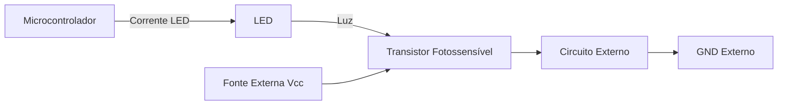
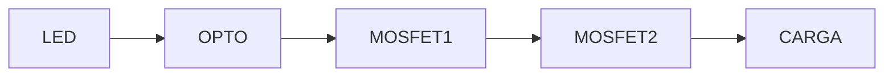
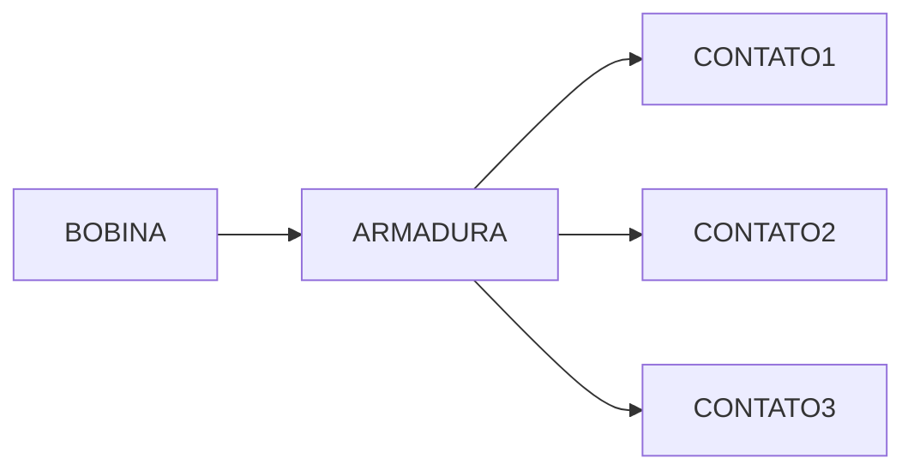

# Circuitos Acopladores em Sistemas Embarcados: Isolamento, Amplificação e Chaveamento de Potência

---

## Introdução

Sistemas embarcados raramente operam isoladamente. Um microcontrolador pode precisar acionar motores, válvulas solenoides, aquecedores, bombas ou cargas industriais alimentadas em 127 V, 220 V ou até tensões trifásicas. Entretanto, seus pinos de saída operam tipicamente em 3,3 V ou 5 V, com capacidade de corrente limitada a poucos miliamperes.

Essa diferença entre o domínio lógico (baixa tensão, baixa corrente, alta sensibilidade) e o domínio físico (alta potência, ruído elétrico, cargas indutivas) exige a utilização de **circuitos acopladores**.

Neste capítulo estudaremos:

* A necessidade de acoplamento em sistemas embarcados
* Optoacopladores e seu princípio físico
* Relés eletromecânicos
* Relés de estado sólido (SSR)
* Contatores
* Encadeamento completo de acoplamento até motores industriais

O objetivo é compreender não apenas os dispositivos, mas a lógica de projeto que garante segurança, robustez e confiabilidade.

---

## Desenvolvimento

## A Necessidade de Acoplamento entre Parte Lógica e Parte Física

### Contexto

Microcontroladores modernos possuem capacidade limitada de corrente por pino. Um valor típico é 20 mA por pino, com limite total agregado por porta ou encapsulamento.

Se uma carga exigir 200 mA, ou 2 A, ou ainda 20 A, o microcontrolador não pode alimentá-la diretamente.

Além disso, cargas como motores e relés produzem:

* Picos de tensão (sobretensão indutiva)
* Ruído eletromagnético
* Transientes rápidos

Esses efeitos podem danificar circuitos digitais.

---

### Conceito

Um circuito acoplador é um estágio intermediário entre o domínio lógico e a carga, cuja função pode incluir:

* Isolamento elétrico
* Amplificação de corrente
* Adaptação de nível de tensão
* Proteção contra ruídos

---

## Optoacopladores (Fotoacopladores)

### Contexto

Quando há necessidade de isolamento elétrico completo entre dois circuitos, utiliza-se o optoacoplador.

É amplamente empregado em acionamento de atuadores industriais e em ambientes com ruído elevado.

---

### Conceito

Um optoacoplador é composto internamente por:

* Um LED emissor de luz
* Um dispositivo fotossensível (geralmente transistor)

Esses dois elementos são encapsulados juntos, mas sem conexão elétrica direta. A transmissão ocorre por fótons.

> Luz presente → nível alto lógico  
> Luz ausente → nível baixo lógico

---

### Estrutura Interna

---

### Funcionamento

1. O microcontrolador aplica tensão ao LED interno.
2. O LED emite luz.
3. O transistor interno é polarizado pela luz.
4. O transistor conduz corrente no circuito secundário.

Não há conexão elétrica entre os dois lados.

---

### Formalização Simplificada

Se o LED é polarizado com corrente $I_{LED}$, o transistor conduz uma corrente proporcional:

$$
I_C = CTR \cdot I_{LED}
$$

Onde:

* $I_C$ = corrente no coletor
* $CTR$ = Current Transfer Ratio (ganho óptico)

---

### Exemplo

Suponha:

* $I_{LED} = 10,mA$
* $CTR = 100%$

Então:

$$
I_C = 1,0 \cdot 10,mA
$$

$$
I_C = 10,mA
$$

Esse valor ainda pode ser insuficiente para um relé, exigindo um transistor adicional.

---

## Amplificação com Transistor

Como o optoacoplador normalmente não fornece corrente suficiente, adiciona-se um transistor amplificador.

O transistor permite chavear correntes maiores para energizar a bobina do relé.

---

## Relés Eletromecânicos

### Contexto

Relés são dispositivos clássicos de chaveamento inventados por Faraday no século XIX. São amplamente utilizados até hoje.

---

### Conceito

Um relé consiste em:

* Uma bobina eletromagnética
* Um núcleo móvel
* Contatos mecânicos

Quando a bobina é energizada, gera um campo magnético que desloca o contato.

---

### Estrutura Conceitual

---

### Nomenclatura dos Contatos

* C → Comum
* NA → Normalmente Aberto
* NF → Normalmente Fechado

---

### Funcionamento

Estado desenergizado:

* C conectado a NF

Estado energizado:

* C conectado a NA

---

### Vantagens

* Isolamento físico total
* Alta robustez

---

### Desvantagens

* Tempo de chaveamento em milissegundos
* Desgaste mecânico
* Formação de arco elétrico

---

## Módulos de Relé

Módulos prontos para Arduino e sistemas embarcados incluem:

* Transistor driver
* Diodo de proteção (flyback)
* LED indicador

Simplificam o projeto e aumentam a confiabilidade.

---

## Relés de Estado Sólido (SSR)

### Contexto

Para aplicações de alta frequência ou longa vida útil, utilizam-se SSR.

---

### Conceito

SSR são compostos por:

* Optoacoplador interno
* MOSFETs ou TRIACs de potência

Sem partes mecânicas.

---

### Estrutura Interna Simplificada

---

### Vantagens

* Chaveamento em microssegundos
* Ausência de arco elétrico
* Vida útil elevada
* Ausência de ruído mecânico

---

### Desvantagens

* Custo elevado
* Sensível a sobretensão
* Dissipação térmica

---

### Potência Dissipada

A potência dissipada pode ser estimada por:

$$
P = I^2 R_{on}
$$

Onde:

* $I$ = corrente na carga
* $R_{on}$ = resistência interna do dispositivo

Se $I = 10,A$ e $R_{on} = 0,2,\Omega$:

$$
P = 10^2 \cdot 0,2
$$

$$
P = 100 \cdot 0,2
$$

$$
P = 20,W
$$

Exige dissipador térmico.

---

## Contatores

### Contexto

Quando a carga é um motor trifásico ou correntes elevadas (20–100 A), utiliza-se contator.

---

### Conceito

É um relé de alta potência com múltiplos contatos principais.

Normalmente possui três polos para sistemas trifásicos.

---

### Estrutura Simplificada

---

## Diagrama Completo de Acoplamento

---

## Exemplo: Partida Suave de Motor

1. Sensor envia sinal ao microcontrolador
2. MCU aciona optoacoplador
3. Transistor amplifica corrente
4. Relé energiza bobina do contator
5. Contator conecta motor à rede

Cada estágio protege o anterior.

---

## Conclusão

Circuitos acopladores são essenciais para integrar sistemas embarcados com cargas reais. Eles fornecem:

* Isolamento elétrico
* Amplificação de corrente
* Proteção contra ruídos
* Capacidade de chaveamento de alta potência

O projeto adequado desses estágios determina a robustez e segurança do sistema.

---

## Análise Crítica

A escolha entre relé eletromecânico, SSR ou contator depende de:

* Frequência de chaveamento
* Corrente da carga
* Vida útil desejada
* Custo
* Ambiente industrial

Não existe solução universal.

---

## Sugestões de Complementação

* Diodo flyback em cargas indutivas
* Análise de transientes (snubber RC)
* Projeto térmico em SSR
* Normas de segurança elétrica industrial

---

## Exercícios Resolvidos

### Exercício 1

Um microcontrolador fornece 5 V e 15 mA. Um relé exige 120 mA.

Explique por que não pode ser ligado diretamente.

**Resposta:** A corrente exigida é 8 vezes maior que a disponível. É necessário transistor ou driver intermediário.

---

### Exercício 2

Um SSR possui $R_{on} = 0,1,\Omega$ e alimenta carga de 15 A. Calcule a potência dissipada.

$$
P = I^2 R
$$

$$
P = 15^2 \cdot 0,1
$$

$$
P = 225 \cdot 0,1
$$

$$
P = 22,5,W
$$

Exige dissipador robusto.

---

## Bibliografia

BOYLESTAD, R. L. Introdução à Análise de Circuitos. Pearson.

SEDRA, A.; SMITH, K. Microelectronic Circuits. Oxford University Press.

HOROWITZ, P.; HILL, W. The Art of Electronics. Cambridge University Press.

---

## Materiais Complementares

HAYT, W.; KEMMERLY, J. Análise de Circuitos em Engenharia. McGraw-Hill.
