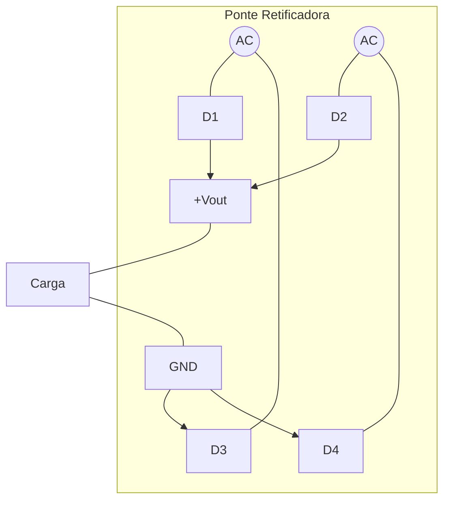
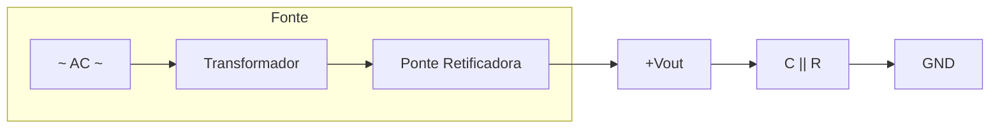

# Aprofundamento em Retificador de Onda Completa: Construção, Ripple e Filtragem Capacitiva

---

## Introdução

O retificador de onda completa é um dos blocos fundamentais na construção de fontes de alimentação lineares para sistemas embarcados. Ele representa um avanço significativo em relação ao retificador de meia onda, pois utiliza ambos os semiciclos da tensão alternada, aumentando o valor médio da tensão retificada e reduzindo a ondulação natural do sinal.

Entretanto, compreender apenas a equação do valor médio não é suficiente para projetar uma fonte confiável. É necessário analisar:

* A construção elétrica da ponte retificadora
* O caminho da corrente em cada semiciclo
* O fenômeno do ripple
* O papel do capacitor de filtragem
* O impacto da variação da capacitância

Este material aprofunda esses aspectos sob a perspectiva de engenharia aplicada a sistemas embarcados.

---

## Construção do Retificador de Onda Completa

### Estrutura Física

O retificador de onda completa mais utilizado é o **retificador em ponte**, composto por quatro diodos.

Sua estrutura pode ser representada pelo seguinte diagrama:



**Esquema simplificado da ponte:**

```
        D1          D2
    +----->|----+------>|---+
    |           |           |
   AC1         +Vout        AC2
    |           |           |
    +---|<-----+-----|<----+
        D3     |     D4
              GND
```

De forma conceitual, a ponte organiza os diodos de modo que, independentemente da polaridade da entrada, a corrente na carga sempre circule no mesmo sentido.

---

### Funcionamento em Cada Semiciclo

#### Semiciclo Positivo

* Dois diodos conduzem.
* Dois permanecem bloqueados.
* A corrente atravessa a carga em um único sentido.

#### Semiciclo Negativo

* Os dois diodos que antes estavam bloqueados passam a conduzir.
* O caminho da corrente muda internamente na ponte.
* A corrente na carga continua no mesmo sentido.

Essa alternância interna é o que permite retificar ambos os semiciclos.

---

## Modelagem Matemática da Saída

Se a entrada é:

$$
v(t) = V_p \sin(\omega t)
$$

A saída ideal da ponte pode ser representada por:

$$
v_{out}(t) = |V_p \sin(\omega t)|
$$

Ou seja, é o valor absoluto da senoide.

Isso significa que os semiciclos negativos são “espelhados” para cima.

---

### Valor Médio

O valor médio da tensão retificada em onda completa é:

$$
V_{médio} = \frac{2V_p}{\pi}
$$

Esse resultado é obtido pela integração da senoide retificada ao longo de um período completo.

---

## O Fenômeno do Ripple

### O Que é Ripple?

Mesmo após a retificação, a tensão não é perfeitamente contínua. Ela assume a forma de pulsos positivos sucessivos.

A diferença entre o valor máximo e o valor mínimo dessa tensão pulsante é chamada de **ripple**.

Em termos físicos, ripple é a ondulação residual sobre a tensão DC.

---

### Frequência do Ripple

Para retificador de onda completa:

$$
f_{ripple} = 2f_{rede}
$$

Se a rede opera a 60 Hz:

$$
f_{ripple} = 120,Hz
$$

Isso significa que há 120 picos por segundo.

Quanto maior a frequência do ripple, mais fácil é filtrá-lo.

---

## Papel do Capacitor de Filtragem

### Construção no Circuito

O capacitor é ligado em paralelo com a carga:



**Esquema simplificado:**

```
  Ponte       +Vout
    |           |
    +-----------+-------+
                |       |
               ---      /
            C  ---      \  R (Carga)
                |       /
                |       |
    +-----------+-------+
               GND
```

> **Nota:** O capacitor (C) e a carga (R) estão conectados em paralelo entre +Vout e GND.
> Quando a ponte fornece tensão, o capacitor carrega. Quando a tensão da ponte cai,
> o capacitor descarrega **através da carga**, mantendo a tensão mais estável.

---

### Funcionamento Dinâmico

Durante o pico da tensão retificada:

* O capacitor carrega até aproximadamente o valor máximo.

Quando a tensão da ponte começa a cair:

* O capacitor começa a descarregar lentamente através da carga.
* Ele mantém a tensão elevada até o próximo pico.

Esse processo reduz drasticamente a variação da tensão.

---

## Análise Quantitativa do Ripple

A aproximação clássica para ripple em retificador de onda completa é:

$$
V_{ripple} \approx \frac{I_{carga}}{f C}
$$

Onde:

* $I_{carga}$ = corrente consumida
* $f$ = frequência do ripple
* $C$ = capacitância

---

### Interpretação Física da Fórmula

Observe que:

* Se $I_{carga}$ aumenta → ripple aumenta
* Se $C$ aumenta → ripple diminui
* Se $f$ aumenta → ripple diminui

Isso revela que capacitores maiores produzem sinal mais estável.

---

## Impacto da Variação da Capacitância

### Caso 1: Capacitância Pequena

Se $C$ é pequeno:

* O capacitor descarrega rapidamente.
* A tensão cai significativamente entre picos.
* O ripple é elevado.

Exemplo:

Suponha:

* $I_{carga} = 0,3,A$
* $f = 120,Hz$
* $C = 470,\mu F = 470 \times 10^{-6} F$

$$
V_{ripple} = \frac{0,3}{120 \cdot 470 \times 10^{-6}}
$$

$$
V_{ripple} = \frac{0,3}{0,0564}
$$

$$
V_{ripple} \approx 5,32,V
$$

Ripple muito alto.

---

### Caso 2: Capacitância Maior

Agora considere:

* $C = 4700,\mu F$

$$
V_{ripple} = \frac{0,3}{120 \cdot 4700 \times 10^{-6}}
$$

$$
V_{ripple} = \frac{0,3}{0,564}
$$

$$
V_{ripple} \approx 0,53,V
$$

Redução significativa da ondulação.

---

## O Que Ocorre ao Aumentar Demais o Capacitor?

Embora aumentar $C$ reduza ripple, existem efeitos práticos:

1. Corrente de pico elevada nos diodos
2. Maior estresse no transformador
3. Maior corrente de surto na energização
4. Custo e volume maiores

Portanto, o projeto deve equilibrar:

* Estabilidade da tensão
* Custo
* Vida útil dos componentes

---

## Comparação Visual Conceitual

Sem capacitor:

* Forma de onda pulsante
* Variação acentuada

Com capacitor pequeno:

* Redução parcial do ripple

Com capacitor grande:

* Tensão quase constante
* Pequena ondulação residual

---

## Conclusão

O retificador de onda completa é significativamente mais eficiente que o de meia onda, pois utiliza ambos os semiciclos da tensão alternada. Entretanto, sua saída ainda é pulsante.

A introdução de um capacitor em paralelo com a carga reduz o ripple ao armazenar energia nos picos e liberá-la nos intervalos. A capacitância determina diretamente a estabilidade da tensão.

Projetos de sistemas embarcados exigem dimensionamento cuidadoso do capacitor, considerando:

* Corrente da carga
* Frequência da rede
* Tensão desejada
* Limitações térmicas e econômicas

---

## Análise Crítica

Embora a filtragem capacitiva melhore significativamente a forma de onda, ela não elimina completamente o ripple. Para aplicações sensíveis, é necessária uma etapa adicional de regulação, como:

* Reguladores lineares
* Conversores chaveados (SMPS)

Além disso, o uso de capacitores muito grandes pode gerar correntes de pico elevadas que comprometem a confiabilidade do sistema.

---

## Sugestões de Complementação

* Análise do retificador com carga resistiva versus carga dinâmica
* Estudo de corrente de surto (inrush current)
* Projeto completo de fonte linear regulada
* Introdução a fontes chaveadas

---

## Exercícios Resolvidos

### Exercício 1

Uma carga consome $0,5,A$ a partir de um retificador de onda completa com ripple máximo permitido de $1,V$. A frequência é 120 Hz.

Determine o capacitor mínimo necessário.

---

**Resolução**

Usamos:

$$
V_{ripple} = \frac{I}{fC}
$$

Isolando $C$:

$$
C = \frac{I}{f V_{ripple}}
$$

Substituindo:

$$
C = \frac{0,5}{120 \cdot 1}
$$

$$
C = \frac{0,5}{120}
$$

$$
C = 0,00417,F
$$

Convertendo:

$$
C = 4170,\mu F
$$

Portanto, deve-se utilizar um capacitor de aproximadamente $4700,\mu F$ para garantir margem de segurança.

---

## Bibliografia

BOYLESTAD, R. L. Introdução à Análise de Circuitos. Pearson.

SEDRA, A.; SMITH, K. Microelectronic Circuits. Oxford University Press.

HAYT, W.; KEMMERLY, J. Análise de Circuitos em Engenharia. McGraw-Hill.

---

## Materiais Complementares

HOROWITZ, P.; HILL, W. The Art of Electronics. Cambridge University Press.
