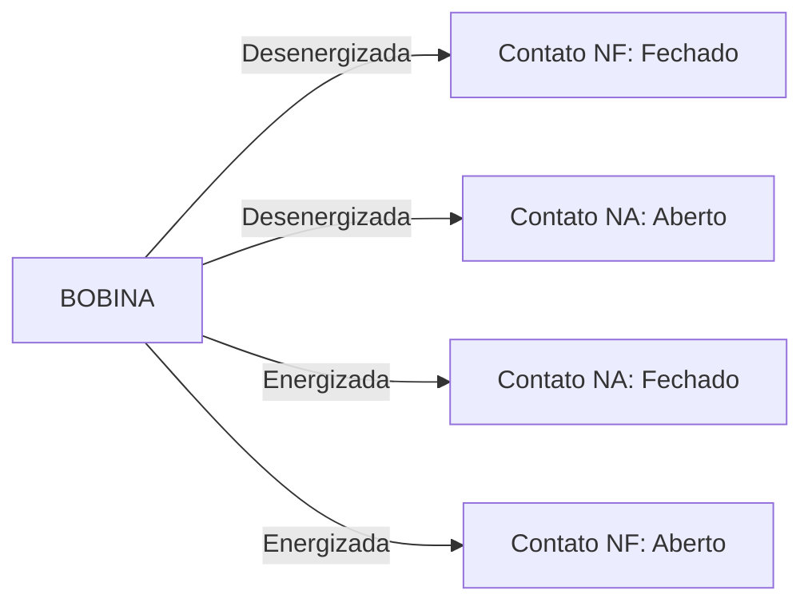
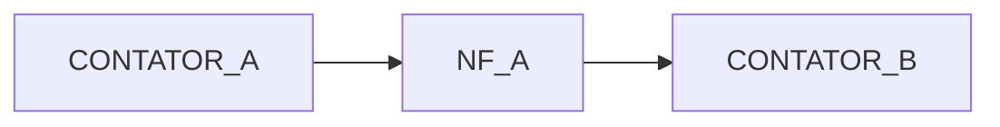

# Contatos “Normalmente Aberto” (NA) e “Normalmente Fechado” (NF) em Relés e Acopladores

---

## 1. Introdução

Em sistemas embarcados que interagem com o mundo físico, o correto entendimento dos termos **Normalmente Aberto (NA)** e **Normalmente Fechado (NF)** é essencial para projetar sistemas seguros, previsíveis e robustos.

Esses conceitos aparecem em:

* Relés eletromecânicos
* Contatores
* Botões industriais
* Sensores com saída por contato
* Intertravamentos de segurança

Neste capítulo, analisaremos:

* O significado técnico do termo “normalmente”
* O comportamento elétrico e lógico de NA e NF
* A implicação em projetos de sistemas embarcados
* Estratégias de segurança industrial
* Erros comuns de interpretação

---

## 2. O que Significa “Normalmente”?

O termo **“normalmente”** refere-se ao estado do dispositivo **na ausência de energização da bobina ou atuador**.

Em outras palavras:

> “Normalmente” = estado em repouso (sem corrente na bobina).

Isso é fundamental.
Não significa “estado mais comum de uso”, e sim **estado sem acionamento elétrico**.

---

## 3. Estrutura de um Relé Eletromecânico

Um relé típico possui:

* Bobina eletromagnética
* Contato comum (C)
* Contato normalmente aberto (NA)
* Contato normalmente fechado (NF)

Ele é classificado como **SPDT (Single Pole Double Throw)**.

---

## 4. Definições Formais

### 4.1 Contato Normalmente Aberto (NA)

* Em repouso: circuito aberto (sem condução)
* Quando energizado: fecha o circuito

Matematicamente:

Se definirmos:

* Estado da bobina = $B$
* Condução do contato = $C$

Para NA:

$$
C = B
$$

Ou seja, conduz quando a bobina está energizada.

---

### 4.2 Contato Normalmente Fechado (NF)

* Em repouso: circuito fechado (há condução)
* Quando energizado: abre o circuito

Matematicamente:

$$
C = \neg B
$$

Conduz quando a bobina NÃO está energizada.

---

## 5. Representação Funcional

Esse comportamento é puramente mecânico no caso de relés.

---

## 6. Análise Lógica Aplicada a Sistemas Embarcados

Considere um microcontrolador acionando um relé para ligar uma lâmpada.

### 6.1 Usando Contato NA

* MCU envia nível alto → relé energiza → lâmpada liga
* MCU envia nível baixo → relé desenergiza → lâmpada desliga

Comportamento intuitivo.

---

### 6.2 Usando Contato NF

* MCU envia nível alto → relé energiza → lâmpada desliga
* MCU envia nível baixo → relé desenergiza → lâmpada liga

Comportamento invertido.

---

## 7. Aplicação em Segurança Industrial (Fail-Safe)

Aqui está o ponto mais importante do capítulo.

Sistemas críticos utilizam **NF para segurança**.

Por quê?

Se houver:

* Falta de energia
* Rompimento de fio
* Queima da bobina

O sistema automaticamente vai para o estado seguro.

---

### Exemplo: Botão de Emergência

Botões de emergência utilizam contato NF.

Motivo:

Se o cabo romper, o sistema detecta circuito aberto e desliga a máquina.

Se fosse NA, um fio rompido não seria detectado.

---

## 8. Aplicação em Contatores Industriais

Contatores possuem:

* Contatos principais (potência)
* Contatos auxiliares (NA e NF)

Os auxiliares são usados para:

* Sinalização
* Intertravamento
* Lógica de controle

---

## 9. Intertravamento Elétrico

Exemplo clássico: impedir dois motores de girarem simultaneamente.

O contato NF auxiliar de A impede que B energize se A estiver ativo.

Essa lógica é amplamente usada em:

* Comandos estrela-triângulo
* Inversão de rotação
* Sistemas redundantes

---

## 10. Comparação Técnica NA vs NF

| Critério                  | NA              | NF                   |
| ------------------------- | --------------- | -------------------- |
| Estado em repouso         | Aberto          | Fechado              |
| Segurança (fail-safe)     | Menor           | Maior                |
| Consumo contínuo          | Só quando ativo | Só quando desativado |
| Detecção de falhas de fio | Difícil         | Fácil                |

---

## 11. Relação com Outros Acopladores

### 11.1 Optoacopladores

Optoacopladores não têm “contato físico”, mas podem ser configurados para comportamento equivalente:

* Saída coletor aberto → comportamento tipo NA
* Uso de pull-up/pull-down → lógica invertida

---

### 11.2 Relé de Estado Sólido (SSR)

SSR geralmente são equivalentes a NA:

* Entrada ativa → saída conduz
* Entrada inativa → saída aberta

Existem modelos específicos com comportamento equivalente a NF, mas são menos comuns.

---

## 12. Exemplo Numérico Aplicado

Suponha um sistema de segurança onde:

* Bobina do relé consome 100 mA
* Fonte de controle pode falhar

Se o sistema usa NA:

* Falha de energia → máquina continua ligada se contato travar fechado.

Se usa NF:

* Falha de energia → máquina desliga automaticamente.

Conclusão técnica: sistemas críticos preferem NF.

---

## 13. Erros Comuns de Projeto

1. Interpretar “normalmente” como “modo habitual”.
2. Não considerar estado durante boot do microcontrolador.
3. Ignorar que pinos digitais podem iniciar em alta impedância.
4. Não prever comportamento em falha de alimentação.

---

## 14. Exercícios Resolvidos

### Exercício 1

Um sistema deve desligar automaticamente se houver falha de energia. Qual contato usar?

**Resposta:** NF.

Justificativa: Em ausência de energia, o circuito abre e desliga a carga.

---

### Exercício 2

Se um relé NA é usado para alimentar um motor, o que ocorre se a bobina queimar?

**Resposta:** O motor nunca ligará.

---

### Exercício 3

Considere:

* Relé com C, NA e NF.
* Fonte 24 V ligada ao comum.
* Carga ligada ao NA.

Qual estado da carga se a bobina estiver desenergizada?

**Resposta:** Desligada (circuito aberto).

---

## 15. Conclusão

Os conceitos de **Normalmente Aberto (NA)** e **Normalmente Fechado (NF)** são fundamentais para:

* Projeto de lógica industrial
* Segurança elétrica
* Sistemas embarcados robustos
* Intertravamentos

Eles não são apenas características físicas — são decisões de engenharia que impactam diretamente a confiabilidade do sistema.

---

## 16. Análise Crítica Final

Projetar com NA ou NF não é escolha estética.

É decisão baseada em:

* Análise de risco
* Tipo de carga
* Requisitos normativos
* Filosofia de segurança (fail-safe)

Em sistemas embarcados industriais, a escolha correta entre NA e NF pode ser a diferença entre um sistema robusto e um sistema perigoso.

---

## 17. Bibliografia

HOROWITZ, P.; HILL, W. The Art of Electronics. Cambridge University Press.

BOYLESTAD, R. Introdução à Análise de Circuitos. Pearson.

SEDRA, A.; SMITH, K. Microelectronic Circuits. Oxford University Press.
