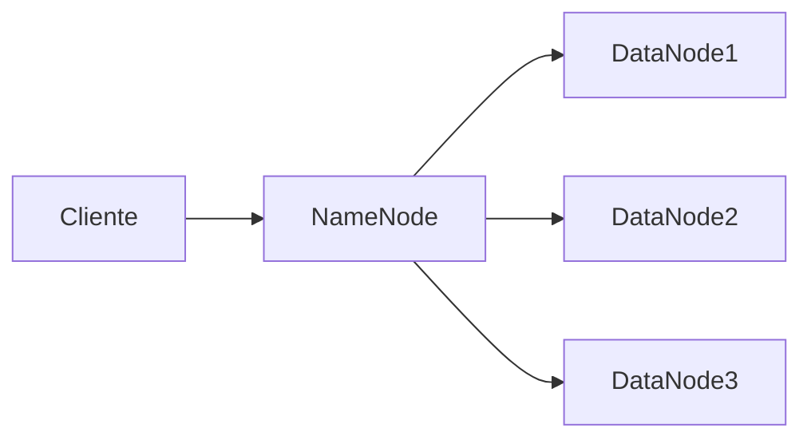

# Armazenamento de Dados em Plataformas de Ingestão e Análise

---

## 1. Introdução

O armazenamento de dados é um dos componentes mais críticos — e frequentemente mais subestimados — de uma plataforma de ingestão e análise. Em sistemas modernos, os dados não apenas precisam ser guardados; eles devem ser armazenados de forma eficiente, recuperáveis em baixa latência, consistentes sob concorrência, escaláveis sob crescimento exponencial e resilientes a falhas.

A complexidade surge porque o armazenamento não é isolado: ele impacta diretamente o processamento, a governança, a segurança, o custo operacional e a experiência analítica. Escolher a abordagem incorreta pode comprometer todo o ecossistema de dados.

Em ambientes corporativos e científicos, decisões arquiteturais sobre armazenamento determinam:

* Tempo de resposta de consultas
* Custo total de propriedade (TCO)
* Capacidade de escalar
* Nível de consistência e confiabilidade
* Tolerância a falhas

Este material explora os fundamentos técnicos que sustentam essas decisões.

---

## 2. Armazenamento e Processamento: Uma Relação Intrínseca

Armazenamento e processamento são camadas interdependentes. A forma como os dados são organizados determina:

* A eficiência das consultas
* O paralelismo possível
* O consumo de rede
* O custo computacional

Se dados estiverem fragmentados inadequadamente, o processamento distribuído pode exigir grande volume de transferência entre nós, degradando performance.

Considere um volume total de dados $V$ distribuído em $n$ nós. A eficiência teórica ideal ocorre quando:

$$
Tempo\_processamento \propto \frac{V}{n}
$$

No entanto, se houver comunicação excessiva entre nós, o tempo real pode ser modelado como:

$$
T = \frac{V}{n} + C_{rede}
$$

Onde $C_{rede}$ representa o custo adicional de sincronização e transferência.

Portanto, decisões de armazenamento impactam diretamente o desempenho computacional.

---

## 3. Transações em Bancos de Dados

### 3.1 Transações em Sistemas Centralizados

Em ambientes centralizados, uma transação é um conjunto de operações que deve obedecer às propriedades ACID:

* **Atomicidade**
* **Consistência**
* **Isolamento**
* **Durabilidade**

Formalmente, se uma transação $T$ for composta por operações $O_1, O_2, ..., O_n$, então:

* Ou todas são aplicadas
* Ou nenhuma é aplicada

Isso garante integridade.

---

### 3.2 Transações em Sistemas Distribuídos

Em sistemas distribuídos, a complexidade aumenta. Dados podem estar espalhados geograficamente. Protocolos como **Two-Phase Commit (2PC)** são utilizados para coordenar consistência.

O desafio é que latência de rede e falhas parciais tornam a garantia ACID mais custosa.

Aqui surge o trade-off central dos sistemas distribuídos.

---

## 4. Escalabilidade

Escalar significa sustentar crescimento de volume e carga.

### 4.1 Escalabilidade Vertical

Consiste em aumentar recursos de um único servidor:

* Mais CPU
* Mais memória
* Mais armazenamento

Matematicamente, se um servidor processa $X$ requisições por segundo e dobramos CPU e memória, espera-se aproximadamente:

$$
Capacidade\_nova \approx 2X
$$

Limitação: existe teto físico.

---

### 4.2 Escalabilidade Horizontal

Consiste em adicionar novos servidores.

Se cada servidor suporta $X$ requisições por segundo e adicionamos $k$ servidores:

$$
Capacidade\_total = k \cdot X
$$

É o modelo predominante em nuvem.

---

### 4.3 Escalabilidade na Nuvem vs Local

**Nuvem:**

* Elasticidade sob demanda
* Provisionamento rápido
* Recursos virtualizados

**Data centers locais:**

* Limitação física
* Alto custo de expansão
* Menor elasticidade

A nuvem transforma CAPEX em OPEX, trazendo previsibilidade financeira.

---

## 5. Consistência de Dados em Sistemas Distribuídos

Quando dados são replicados, surge o problema de consistência.

Se um dado $D$ estiver replicado em três nós ($N_1, N_2, N_3$), após uma atualização:

* Todos devem refletir o mesmo valor.
* Caso contrário, inconsistência emerge.

Podemos modelar consistência forte como:

$$
\forall i,j: D_{N_i} = D_{N_j}
$$

Em sistemas distribuídos, manter essa igualdade sob falhas é complexo.

---

## 6. Teorema CAP

O **Teorema CAP** afirma que um sistema distribuído pode garantir apenas dois dos três atributos simultaneamente:

* **Consistência (C)**
* **Disponibilidade (A)**
* **Tolerância à Partição (P)**

Em presença de partições de rede, é necessário escolher entre:

* Priorizar consistência (CP)
* Priorizar disponibilidade (AP)

Não é possível garantir os três simultaneamente.

---

## 7. Tolerância a Falhas

Tolerância a falhas depende de:

* Fragmentação (sharding)
* Replicação
* Distribuição geográfica

Se cada fragmento possuir $r$ réplicas, a probabilidade de indisponibilidade reduz-se drasticamente.

Se a probabilidade de falha de um nó for $p$, então a probabilidade de todas as $r$ réplicas falharem simultaneamente é:

$$
P_{falha} = p^r
$$

Exemplo:

Se $p = 0{,}1$ e $r = 3$:

$$
P_{falha} = 0{,}1^3 = 0{,}001
$$

Ou seja, 0,1%.

---

## 8. Infraestrutura de Banco de Dados em Nuvem

### 8.1 Vantagens

* Elasticidade
* Backup automatizado
* Segurança gerenciada
* Monitoramento integrado
* Previsibilidade de custo

---

### 8.2 Banco de Dados como Serviço (DBaaS)

DBaaS permite utilizar banco de dados sem gerenciar infraestrutura.

Responsabilidades do provedor:

* Patch de segurança
* Alta disponibilidade
* Escalabilidade automática

O engenheiro foca na modelagem e performance.

---

## 9. Abordagens de Persistência

### 9.1 Sistemas de Arquivos Distribuídos

Exemplos clássicos incluem GFS e HDFS.

Características:

* Divisão em blocos
* Replicação automática
* Processamento próximo aos dados

---

### 9.2 Modelo Chave-Valor

Baseado em tabelas hash distribuídas.

Função hash:

$$
Nó = hash(chave) \mod n
$$

Isso determina onde o dado será armazenado.

Ideal para:

* Alta escalabilidade
* Baixa latência
* Estrutura flexível

---

### 9.3 Modelo Relacional (Colunas/Vetores)

Organiza dados em tabelas com linhas e colunas.

Consultas estruturadas via SQL.

Adequado para:

* Integridade referencial
* Transações complexas
* Relatórios estruturados

---

## 10. Classificação de Bancos de Dados

### 10.1 Relacionais

* SQL Azure
* RDS

Características:

* Modelo tabular
* ACID
* Estrutura rígida

---

### 10.2 Não Relacionais (NoSQL)

* Dynamo (chave-valor)
* MongoDB (documento)
* Neo4j (grafo)

Características:

* Flexibilidade de esquema
* Escalabilidade horizontal
* Eventual consistency

---

## 11. Conclusão

O armazenamento em plataformas de ingestão e análise de dados é um problema multidimensional que envolve:

* Arquitetura distribuída
* Teoria de consistência
* Estratégias de escalabilidade
* Trade-offs econômicos
* Engenharia de confiabilidade

Não existe solução universal. Cada escolha implica compromissos entre desempenho, custo, consistência e disponibilidade.

O papel do engenheiro de dados é compreender profundamente esses trade-offs e projetar sistemas adequados ao contexto organizacional.

---

## 12. Análise Crítica

* Escalabilidade horizontal exige complexidade adicional.
* Consistência forte pode reduzir disponibilidade.
* Nuvem reduz gestão operacional, mas aumenta dependência de fornecedor.
* NoSQL não substitui SQL — são soluções para problemas distintos.

---

## 13. Exercícios

### Exercício 1 – Escalabilidade Horizontal

Cada servidor suporta 500 requisições/s. Quantos servidores são necessários para suportar 10.000 requisições/s?

$$
k = \frac{10000}{500}
$$

$$
k = 20
$$

São necessários 20 servidores.

---

### Exercício 2 – Probabilidade de Falha

Se $p = 0{,}05$ e $r = 4$:

$$
P_{falha} = (0{,}05)^4
$$

$$
P_{falha} = 0{,}00000625
$$

Probabilidade extremamente baixa.

---

## 14. Bibliografia

KLEPPMANN, Martin. *Designing Data-Intensive Applications*. O’Reilly, 2017.

TANENBAUM, Andrew; VAN STEEN, Maarten. *Distributed Systems*. Pearson, 2016.

INMON, William. *Building the Data Warehouse*. Wiley, 2005.

---

Este conteúdo estabelece a base conceitual necessária para projetar arquiteturas robustas de armazenamento em ambientes distribuídos e escaláveis.
