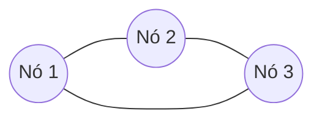

# Ferramentas de Armazenamento e Bancos de Dados NoSQL em Plataformas de Ingestão e Análise de Dados

---

## 1. Introdução

À medida que aplicações digitais se tornaram distribuídas, escaláveis e orientadas a eventos, o modelo tradicional de armazenamento baseado exclusivamente em bancos de dados relacionais passou a não atender integralmente às novas demandas. Plataformas modernas de ingestão e análise de dados precisam lidar com volumes massivos, esquemas dinâmicos, dados semi-estruturados e relacionamentos complexos em tempo real.

Nesse cenário, surgem diferentes ferramentas e abordagens para armazenamento e recuperação de dados, especialmente em ambientes de nuvem. Entre elas destacam-se os bancos de dados NoSQL, sistemas distribuídos projetados para escalabilidade horizontal, alta disponibilidade e flexibilidade estrutural.

Compreender essas tecnologias não é apenas uma questão técnica, mas uma decisão arquitetural estratégica que impacta desempenho, custo, integridade e evolução da aplicação.

---

## 2. Ferramentas para Armazenamento e Recuperação de Dados na Nuvem

Em ambientes de nuvem, o armazenamento deixa de ser um recurso físico fixo e passa a ser provisionado sob demanda. Isso modifica profundamente as decisões de arquitetura.

Uma ferramenta de armazenamento deve garantir:

* Persistência confiável
* Recuperação eficiente
* Escalabilidade sob crescimento
* Distribuição geográfica
* Segurança gerenciada

A elasticidade é um diferencial central. Se uma aplicação recebe uma carga variável de requisições ao longo do tempo, a infraestrutura deve acompanhar essa variação.

Se a taxa de requisições por segundo for representada por $\lambda(t)$, a capacidade computacional ideal deveria ajustar-se dinamicamente de forma proporcional:

$$
Capacidade(t) \propto \lambda(t)
$$

Esse ajuste dinâmico é viabilizado por virtualização e orquestração automatizada na nuvem.

---

## 3. Bancos de Dados Relacionais versus Não Relacionais

### 3.1 Contexto

O modelo relacional organiza dados em tabelas estruturadas com esquemas fixos. Esse modelo foi dominante por décadas devido à sua robustez e consistência transacional.

Entretanto, aplicações modernas apresentam:

* Dados heterogêneos
* Estruturas variáveis
* Escala massiva
* Necessidade de distribuição global

Surge então o paradigma NoSQL.

---

### 3.2 Conceito

Bancos NoSQL (Not Only SQL) não seguem obrigatoriamente o modelo tabular tradicional. Podem ser classificados em:

* Chave-valor
* Documento
* Colunar
* Grafo

Diferentemente dos relacionais, o esquema pode ser flexível ou inexistente.

---

### 3.3 Funcionamento e Impacto Arquitetural

Em um banco relacional, alterar a estrutura implica modificar o esquema global. Em um banco de documentos, cada registro pode conter campos diferentes.

Se definirmos um conjunto de atributos como:

$$
E = {a_1, a_2, ..., a_n}
$$

No modelo relacional, todos os registros compartilham $E$.
No modelo de documentos, cada registro pode possuir um subconjunto diferente de $E$.

Essa flexibilidade favorece evolução contínua da aplicação.

---

## 4. Neo4j: Banco de Dados Orientado a Grafos

### 4.1 Contexto

Quando o problema central envolve relacionamentos complexos — como redes sociais, sistemas de recomendação ou análise de fraudes — o modelo relacional torna-se ineficiente.

---

### 4.2 Conceito

O Neo4j é um banco de dados orientado a grafos. Seu modelo baseia-se em:

* Nós (entidades)
* Relacionamentos
* Propriedades

---

### 4.3 Funcionamento

Internamente, cada nó armazena ponteiros diretos para seus relacionamentos. Isso evita joins custosos.

Se a complexidade de um join relacional for aproximadamente:

$$
O(n \cdot m)
$$

A navegação em grafos tende a:

$$
O(k)
$$

Onde $k$ é o número de relacionamentos diretamente conectados.

---

### 4.4 Propriedades ACID

Diferentemente de muitos NoSQL, o Neo4j suporta transações ACID completas, garantindo integridade forte.

---

## 5. CouchDB: Banco de Documentos

### 5.1 Contexto

Aplicações web frequentemente trabalham com JSON. Um banco orientado a documentos permite armazenar diretamente essas estruturas.

---

### 5.2 Conceito

O CouchDB armazena documentos JSON com identificadores únicos.

Cada documento pode conter campos distintos.

---

### 5.3 Escalabilidade e Disponibilidade

CouchDB suporta replicação multi-master. Se cada nó possui probabilidade de falha $p$, e temos $r$ réplicas:

$$
P_{falha\_total} = p^r
$$

Exemplo:

Se $p = 0{,}1$ e $r = 2$:

$$
P = 0{,}01
$$

Redução significativa de indisponibilidade.

---

### 5.4 Metadados e Esquema Independente

O esquema não é rigidamente imposto. Metadados podem descrever estrutura lógica sem forçar uniformidade.

Isso permite evolução incremental da aplicação.

---

## 6. Cassandra: Banco Distribuído de Alto Desempenho

### 6.1 Contexto

Aplicações globais exigem:

* Alta disponibilidade
* Escrita massiva
* Distribuição geográfica

---

### 6.2 Conceito

Cassandra é um banco distribuído baseado em arquitetura peer-to-peer.

Não existe nó mestre único.

---

### 6.3 Modelo de Distribuição

A distribuição utiliza hashing consistente.

A posição de um dado é definida por:

$$
Posição = hash(chave)
$$

Essa estratégia reduz reestruturação quando novos nós são adicionados.

---

### 6.4 Consistência Configurável

Cassandra permite definir nível de consistência:

Se existirem $N$ réplicas, e:

* $W$ = número mínimo de escritas confirmadas
* $R$ = número mínimo de leituras

Para garantir consistência forte:

$$
W + R > N
$$

Exemplo:

Se $N = 3$, então:

* $W = 2$
* $R = 2$

Como:

$$
2 + 2 > 3
$$

A condição é satisfeita.

---

## 7. APIs REST e Bancos NoSQL

### 7.1 Contexto

Aplicações modernas comunicam-se via HTTP.

---

### 7.2 Conceito

APIs REST utilizam:

* GET (leitura)
* POST (inserção)
* PUT (atualização)
* DELETE (remoção)

No contexto NoSQL, essas operações interagem diretamente com documentos ou chaves.

---

### 7.3 Funcionamento

Uma requisição GET pode retornar um documento JSON completo, eliminando necessidade de joins.

Isso simplifica integração com aplicações frontend.

---

## 8. Integridade dos Dados em Bancos Não Estruturados

A ausência de esquema rígido não implica ausência de integridade.

Mecanismos incluem:

* Validação na aplicação
* Regras de consistência configuráveis
* Transações parciais
* Versionamento de documentos

A integridade passa a ser responsabilidade compartilhada entre banco e aplicação.

---

## 9. Distribuição e Replicação

Distribuição melhora desempenho e reduz latência geográfica.

Replicação melhora disponibilidade.

Se a latência média entre cliente e servidor for $L$, e o dado estiver replicado em múltiplas regiões, o tempo de resposta tende a:

$$
T \approx \min(L_1, L_2, ..., L_n)
$$

A replicação permite servir dados da região mais próxima.

---

## 10. Casos de Uso de Bancos NoSQL

Grandes plataformas digitais utilizam NoSQL para:

* Processar bilhões de eventos por dia
* Armazenar logs de acesso
* Gerenciar redes sociais
* Sistemas de recomendação

Empresas com tráfego global precisam de bancos distribuídos e escaláveis horizontalmente.

---

## 11. Conclusão

Ferramentas de armazenamento em nuvem e bancos NoSQL representam uma evolução arquitetural necessária para lidar com:

* Escala massiva
* Dados dinâmicos
* Distribuição global
* Elasticidade

Não substituem completamente os bancos relacionais, mas ampliam o arsenal do engenheiro de dados.

A escolha deve sempre considerar:

* Tipo de dado
* Padrão de acesso
* Necessidade de consistência
* Crescimento esperado

---

## 12. Análise Crítica

* Flexibilidade excessiva pode gerar desorganização sem governança.
* Consistência eventual exige cuidado em aplicações financeiras.
* Distribuição aumenta complexidade operacional.
* Nem todo problema exige NoSQL.

Arquitetura deve ser guiada por requisitos, não por tendência tecnológica.

---

## 13. Exercícios (com resolução)

### Exercício 1 – Consistência em Cassandra

Se $N = 5$, qual combinação mínima de $W$ e $R$ garante consistência forte?

Precisamos:

$$
W + R > 5
$$

Uma possível solução:

$$
W = 3,\quad R = 3
$$

Como:

$$
3 + 3 = 6 > 5
$$

Condição satisfeita.

---

### Exercício 2 – Probabilidade de Indisponibilidade

Se cada nó tem probabilidade $p = 0{,}02$ de falha e existem $r = 3$ réplicas:

$$
P = (0{,}02)^3
$$

$$
P = 0{,}000008
$$

Indisponibilidade extremamente baixa.

---

## 14. Bibliografia

KLEPPMANN, Martin. *Designing Data-Intensive Applications*. O’Reilly, 2017.

FOWLER, Martin. *NoSQL Distilled*. Addison-Wesley, 2012.

TANENBAUM, Andrew; VAN STEEN, Maarten. *Distributed Systems*. Pearson, 2016.

---

## 15. Materiais Complementares

DEHGHANI, Zhamak. *Data Mesh*. O’Reilly, 2022.

SADALAGE, Pramod; FOWLER, Martin. *NoSQL Distilled*. Addison-Wesley, 2013.

---

