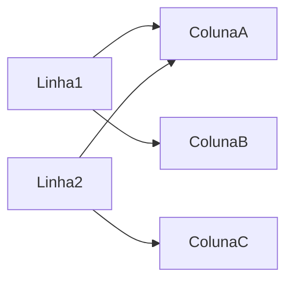
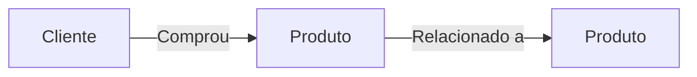

# Tipos de Bancos de Dados NoSQL e Seus Usos em Plataformas de Ingestão e Análise de Dados

---

## 1. Introdução

A evolução das plataformas de ingestão e análise de dados trouxe consigo novos desafios estruturais: volumes massivos, dados heterogêneos, latência global e necessidade de escalabilidade horizontal. Nesse cenário, os bancos de dados NoSQL surgem como alternativas arquiteturais ao modelo relacional tradicional, oferecendo flexibilidade estrutural e distribuição nativa.

Entretanto, “NoSQL” não é uma tecnologia única. Trata-se de uma família de modelos de dados distintos, cada um projetado para resolver um tipo específico de problema. Compreender **quando e por que utilizar cada tipo** é essencial para projetar arquiteturas eficientes e sustentáveis.

Este material explora, de forma estruturada e aprofundada, os principais tipos de bancos NoSQL:

* Key-Value
* Document Store (DocumentDB)
* Column Family (Wide-Column)
* Graph Database

---

## 2. Modelo Key-Value

### 2.1 Contexto

O modelo chave-valor é o mais simples entre os bancos NoSQL. Ele é amplamente utilizado em cenários onde o acesso é direto e previsível, como cache distribuído, sessões de usuário e armazenamento de estados temporários.

Em plataformas de ingestão de dados, é comum utilizá-lo para armazenar:

* Tokens de autenticação
* Estados intermediários de processamento
* Dados temporários de pipeline

---

### 2.2 Conceito

O armazenamento é feito como um grande mapa (ou dicionário):

$$
\text{chave} \rightarrow \text{valor}
$$

Cada chave é única e aponta para um valor arbitrário (string, JSON, binário etc.).

---

### 2.3 Funcionamento Interno

A localização do dado é feita por meio de uma função hash:

$$
nó = hash(chave) \mod N
$$

Onde:

* $N$ é o número de nós do cluster
* $hash(chave)$ determina a posição do dado

Esse mecanismo permite distribuição automática.

---

### 2.4 Exemplo

Suponha um sistema de autenticação com 4 nós.

Se:

$$
hash("user123") = 57
$$

E:

$$
57 \mod 4 = 1
$$

O dado será armazenado no nó 1.

---

### 2.5 Casos de Uso

* Cache distribuído (ex: sessões web)
* Sistemas de alta leitura com baixa complexidade estrutural
* Filas simples de estado

Não é adequado quando há necessidade de consultas complexas ou relacionamentos.

---

## 3. Modelo Document Store (DocumentDB)

### 3.1 Contexto

Aplicações modernas trabalham com dados em formato JSON. APIs REST retornam objetos estruturados que variam ao longo do tempo. O modelo documental foi criado para refletir essa realidade.

---

### 3.2 Conceito

Cada registro é um documento estruturado, geralmente em JSON:

```json
{
  "usuario": "Maria",
  "idade": 29,
  "interesses": ["dados", "IA"],
  "endereco": {
      "cidade": "São Paulo",
      "estado": "SP"
  }
}
```

Cada documento pode ter estrutura diferente.

---

### 3.3 Funcionamento

Os documentos são indexados por identificadores únicos. Consultas podem ser feitas por campos internos.

Diferentemente do modelo relacional, não há necessidade de normalização rígida.

---

### 3.4 Vantagens Arquiteturais

* Evolução flexível de esquema
* Integração direta com APIs REST
* Boa performance para leitura e escrita

---

### 3.5 Casos de Uso

* Aplicações web e mobile
* Plataformas SaaS multi-tenant
* Sistemas de catálogo de produtos
* Logs estruturados

Ideal quando os dados possuem estrutura hierárquica ou variam frequentemente.

---

## 4. Modelo Column Family (Wide-Column)

### 4.1 Contexto

Quando o volume de dados é extremamente alto — bilhões de registros — e o padrão de acesso é previsível por chave primária, o modelo column family torna-se eficiente.

---

### 4.2 Conceito

Organiza dados em tabelas com linhas e famílias de colunas.

Diferentemente do modelo relacional, cada linha pode possuir colunas diferentes.

---

### 4.3 Estrutura Conceitual



Não é obrigatório que todas as linhas compartilhem as mesmas colunas.

---

### 4.4 Distribuição e Escalabilidade

A distribuição também utiliza hashing consistente:

$$
particao = hash(chave\_primaria)
$$

Isso permite escalabilidade horizontal quase linear.

Se cada nó suporta $X$ operações por segundo e adicionamos $k$ nós:

$$
Capacidade\_total = k \cdot X
$$

---

### 4.5 Casos de Uso

* Sistemas de telemetria
* IoT
* Processamento de logs massivos
* Análise de eventos em larga escala

É extremamente eficiente para escrita intensa.

---

## 5. Modelo Graph Database

### 5.1 Contexto

Alguns problemas não são centrados em dados isolados, mas nas relações entre eles.

Exemplos:

* Redes sociais
* Sistemas de recomendação
* Detecção de fraude
* Cadeias logísticas

---

### 5.2 Conceito

Baseado em grafos:

* Nós (entidades)
* Arestas (relacionamentos)
* Propriedades



---

### 5.3 Funcionamento

A navegação entre nós ocorre por ponteiros diretos, eliminando joins complexos.

Se a busca relacional exige múltiplos joins com custo aproximado:

$$
O(n^2)
$$

A navegação em grafos depende apenas do número de conexões relevantes:

$$
O(k)
$$

Onde $k$ é o grau do nó.

---

### 5.4 Casos de Uso

* Análise de redes sociais
* Recomendação baseada em conexões
* Sistemas antifraude
* Modelagem de conhecimento

Ideal quando relacionamentos são o elemento central da aplicação.

---

## 6. Comparação Arquitetural

| Modelo        | Melhor Para     | Estrutura         | Escalabilidade | Complexidade |
| ------------- | --------------- | ----------------- | -------------- | ------------ |
| Key-Value     | Cache e sessões | Simples           | Muito alta     | Baixa        |
| Document      | Aplicações web  | JSON flexível     | Alta           | Média        |
| Column Family | Big Data        | Colunas dinâmicas | Muito alta     | Alta         |
| Graph         | Relacionamentos | Nós e arestas     | Moderada       | Alta         |

---

## 7. Conclusão

Os bancos NoSQL não substituem o modelo relacional; eles o complementam. Cada tipo resolve um conjunto específico de problemas:

* Se o foco é simplicidade e velocidade → Key-Value
* Se o foco é flexibilidade estrutural → Document
* Se o foco é escala massiva de escrita → Column Family
* Se o foco são relações complexas → Graph

A escolha correta depende do padrão de acesso, da natureza do dado e dos requisitos de consistência.

Projetar uma plataforma de dados moderna implica frequentemente em arquitetura poliglota, combinando múltiplos tipos de bancos.

---

## 8. Análise Crítica

* Flexibilidade excessiva pode gerar desorganização sem governança.
* Nem todos os problemas exigem distribuição massiva.
* A escolha inadequada pode gerar sobrecarga operacional.
* Arquitetura deve ser guiada por requisitos, não por modismo tecnológico.

---

## 9. Bibliografia

KLEPPMANN, Martin. *Designing Data-Intensive Applications*. O’Reilly, 2017.

SADALAGE, Pramod; FOWLER, Martin. *NoSQL Distilled*. Addison-Wesley, 2013.

TANENBAUM, Andrew; VAN STEEN, Maarten. *Distributed Systems*. Pearson, 2016.

---

## 10. Materiais Complementares

DEHGHANI, Zhamak. *Data Mesh*. O’Reilly, 2022.

STONEBRAKER, Michael. *Readings in Database Systems*. MIT Press, 2015.

---
